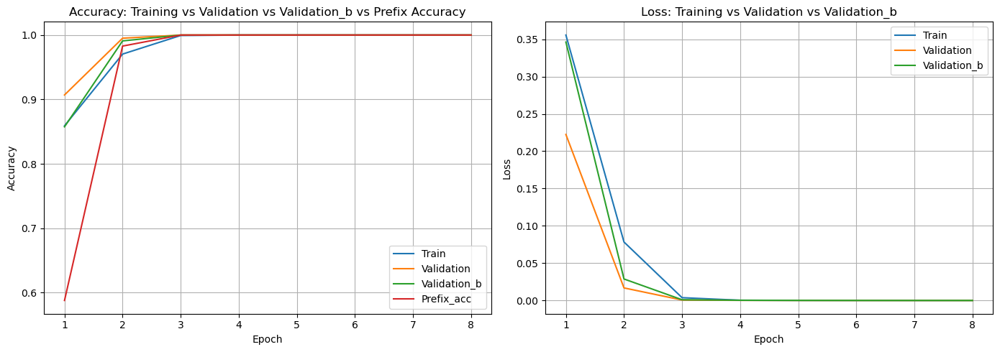
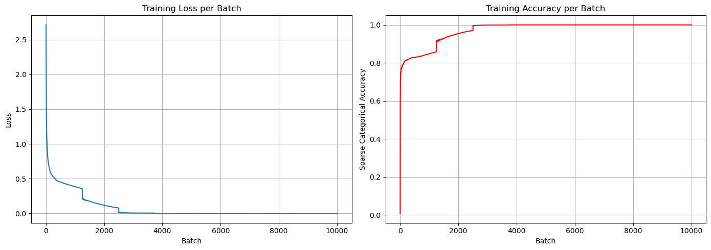

# Project Evolution

I start trying overfitting.

- **FIXED**:
    |train| = 10_000  
    | val | = 1_000  


---

# v0

## Iperparametri
- **embed_dim**: 32
- **enc_units**: 256
- **dec_units**: 256
- **batch_size**: 256

## Output di celle
### training
```
Epoch 1/30

40/40 ━━━━━━━━━━━━━━━━━━━━ 50s 1s/step - loss: 0.0050 - sparse_categorical_accuracy: 0.9997 - val_loss: 0.0050 - val_sparse_categorical_accuracy: 0.9995 - val_prefix_acc: 0.9966 - val_b_sparCateg_accuracy: 0.9991 - val_b_loss: 0.0090
```

### test
```
================================================
round=0
------------------------------------------------
mean scores=1.0000 std=0.0000
================================================
round=1
------------------------------------------------
mean scores=1.0000 std=0.0000
================================================
round=2
------------------------------------------------
mean scores=1.0000 std=0.0000
================================================
round=3
------------------------------------------------
mean scores=0.9923 std=0.0335
================================================
round=4
------------------------------------------------
mean scores=1.0000 std=0.0000
================================================
round=5
------------------------------------------------
mean scores=0.9654 std=0.1343
================================================
round=6
------------------------------------------------
mean scores=1.0000 std=0.0000
================================================
round=7
------------------------------------------------
mean scores=0.9889 std=0.0484
================================================
round=8
------------------------------------------------
mean scores=1.0000 std=0.0000
================================================
round=9
------------------------------------------------
mean scores=1.0000 std=0.0000
================================================
FINAL SCORE = 0.9947 STD = 0.0105
```

### test_bonus
```
~~~~~~~~~~Testing with max_depth=3~~~~~~~~~~~~
================================================
round=0
------------------------------------------------
mean scores=0.9923 std=0.0335
================================================
round=1
------------------------------------------------
mean scores=1.0000 std=0.0000
================================================
FINAL SCORE = 0.9962 STD = 0.0038
~~~~~~~~~~Testing with max_depth=5~~~~~~~~~~~~
================================================
round=0
------------------------------------------------
mean scores=1.0000 std=0.0000
================================================
round=1
------------------------------------------------
mean scores=1.0000 std=0.0000
================================================
FINAL SCORE = 1.0000 STD = 0.0000
~~~~~~~~~~Testing with max_depth=7~~~~~~~~~~~~
================================================
round=0
------------------------------------------------
mean scores=1.0000 std=0.0000
================================================
round=1
------------------------------------------------
mean scores=1.0000 std=0.0000
================================================
FINAL SCORE = 1.0000 STD = 0.0000
~~~~~~~~~~Testing with max_depth=9~~~~~~~~~~~~
================================================
round=0
------------------------------------------------
mean scores=1.0000 std=0.0000
================================================
round=1
------------------------------------------------
mean scores=1.0000 std=0.0000
================================================
FINAL SCORE = 1.0000 STD = 0.0000
~~~~~~~~~~Testing with max_depth=11~~~~~~~~~~~~
================================================
round=0
------------------------------------------------
mean scores=0.9794 std=0.0624
================================================
round=1
------------------------------------------------
mean scores=1.0000 std=0.0000
================================================
FINAL SCORE = 0.9897 STD = 0.0103
~~~~~~~~~~Testing with max_depth=13~~~~~~~~~~~~
================================================
round=0
------------------------------------------------
mean scores=0.9923 std=0.0335
================================================
round=1
------------------------------------------------
mean scores=0.9962 std=0.0168
================================================
FINAL SCORE = 0.9942 STD = 0.0019
~~~~~~~~~~Testing with max_depth=15~~~~~~~~~~~~
================================================
round=0
------------------------------------------------
mean scores=0.9846 std=0.0671
================================================
round=1
------------------------------------------------
mean scores=0.9923 std=0.0335
================================================
FINAL SCORE = 0.9885 STD = 0.0038
~~~~~~~~~~Testing with max_depth=17~~~~~~~~~~~~
================================================
round=0
------------------------------------------------
mean scores=1.0000 std=0.0000
================================================
round=1
------------------------------------------------
mean scores=0.9944 std=0.0242
================================================
FINAL SCORE = 0.9972 STD = 0.0028
~~~~~~~~~~Testing with max_depth=19~~~~~~~~~~~~
================================================
round=0
------------------------------------------------
mean scores=0.9962 std=0.0168
================================================
round=1
------------------------------------------------
mean scores=1.0000 std=0.0000
================================================
FINAL SCORE = 0.9981 STD = 0.0019
```

## Figure
### epoch


### batch



