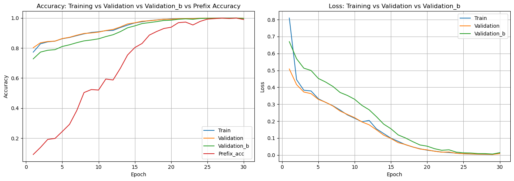

# Project Evolution

I start trying overfitting. So I set all the iperparams hight.
- optimizer="adam",
- loss="sparse_categorical_crossentropy",
- metrics=["sparse_categorical_accuracy"]
- EARLY STOPPING 1  
    monitor="val_loss",  
    patience=5,  
    min_delta=0.003  
- EARLY STOPPING 2  
    monitor="val_prefix_acc",  
    mode="max",  
    patience=5,  
    min_delta=0.001

- **FIXED**:  
    |train| = 10_000  
    | val | = 1_000
    |val_b| = 1_000 unseen data


---

Batch size modification

---

# v1.0

## Iperparametri
- **embed_dim**: 32
- **enc_units**: 256
- **dec_units**: 256
- **batch_size**: 256

## Output di celle
### training
```
Epoch 030 | Loss: 0.0048 | Accuracy: 0.9998 | Val Loss: 0.0050 | Val Accuracy: 0.9966 | Val B Loss: 0.0090 | Val B Accuracy: 0.9991 | Prefix Acc: 0.9966
```

### test
```
================================================
FINAL SCORE = 0.9947 STD = 0.0105
```

### test_bonus
```

~~~~~~~~~~Testing with max_depth=3~~~~~~~~~~~~
================================================
FINAL SCORE = 0.9972 STD = 0.0064
================================================
FINAL SCORE = 0.9949 STD = 0.0045
================================================
FINAL SCORE = 0.9950 STD = 0.0055
================================================
FINAL SCORE = 0.9993 STD = 0.0020
================================================
FINAL SCORE = 0.9991 STD = 0.0027
================================================
FINAL SCORE = 0.9948 STD = 0.0061
================================================
FINAL SCORE = 0.9972 STD = 0.0043
================================================
FINAL SCORE = 0.9986 STD = 0.0029
================================================
FINAL SCORE = 0.9942 STD = 0.0092
```


---

# v1.1

## Iperparametri
- **embed_dim**: 32
- **enc_units**: 256
- **dec_units**: 256
- **batch_size**: 128

## Output di celle
### training
```
Epoch 001 | Loss: 0.6656 | Accuracy: 0.7937 | Val Loss: 0.4369 | Val Accuracy: 0.1322 | Val B Loss: 0.6076 | Val B Accuracy: 0.7588 | Prefix Acc: 0.1322
Epoch 002 | Loss: 0.4013 | Accuracy: 0.8357 | Val Loss: 0.3711 | Val Accuracy: 0.1742 | Val B Loss: 0.5291 | Val B Accuracy: 0.7790 | Prefix Acc: 0.1742
Epoch 003 | Loss: 0.3435 | Accuracy: 0.8551 | Val Loss: 0.3309 | Val Accuracy: 0.2746 | Val B Loss: 0.4707 | Val B Accuracy: 0.8028 | Prefix Acc: 0.2746
Epoch 004 | Loss: 0.3053 | Accuracy: 0.8733 | Val Loss: 0.2813 | Val Accuracy: 0.3867 | Val B Loss: 0.4052 | Val B Accuracy: 0.8352 | Prefix Acc: 0.3867
Epoch 005 | Loss: 0.2510 | Accuracy: 0.8984 | Val Loss: 0.2260 | Val Accuracy: 0.5403 | Val B Loss: 0.3480 | Val B Accuracy: 0.8537 | Prefix Acc: 0.5403
Epoch 006 | Loss: 0.2053 | Accuracy: 0.9124 | Val Loss: 0.1869 | Val Accuracy: 0.5926 | Val B Loss: 0.2945 | Val B Accuracy: 0.8771 | Prefix Acc: 0.5926
Epoch 007 | Loss: 0.1660 | Accuracy: 0.9298 | Val Loss: 0.1485 | Val Accuracy: 0.6988 | Val B Loss: 0.2393 | Val B Accuracy: 0.9017 | Prefix Acc: 0.6988
Epoch 008 | Loss: 0.1340 | Accuracy: 0.9477 | Val Loss: 0.1143 | Val Accuracy: 0.7552 | Val B Loss: 0.1900 | Val B Accuracy: 0.9266 | Prefix Acc: 0.7552
Epoch 009 | Loss: 0.0978 | Accuracy: 0.9642 | Val Loss: 0.0854 | Val Accuracy: 0.8011 | Val B Loss: 0.1466 | Val B Accuracy: 0.9461 | Prefix Acc: 0.8011
Epoch 010 | Loss: 0.0661 | Accuracy: 0.9774 | Val Loss: 0.0527 | Val Accuracy: 0.9017 | Val B Loss: 0.0938 | Val B Accuracy: 0.9684 | Prefix Acc: 0.9017
Epoch 011 | Loss: 0.0443 | Accuracy: 0.9860 | Val Loss: 0.0441 | Val Accuracy: 0.9092 | Val B Loss: 0.0786 | Val B Accuracy: 0.9749 | Prefix Acc: 0.9092
Epoch 012 | Loss: 0.0300 | Accuracy: 0.9916 | Val Loss: 0.0245 | Val Accuracy: 0.9213 | Val B Loss: 0.0453 | Val B Accuracy: 0.9874 | Prefix Acc: 0.9213
Epoch 013 | Loss: 0.0197 | Accuracy: 0.9954 | Val Loss: 0.0188 | Val Accuracy: 0.9616 | Val B Loss: 0.0351 | Val B Accuracy: 0.9898 | Prefix Acc: 0.9616
Epoch 014 | Loss: 0.0132 | Accuracy: 0.9975 | Val Loss: 0.0124 | Val Accuracy: 0.9829 | Val B Loss: 0.0223 | Val B Accuracy: 0.9950 | Prefix Acc: 0.9829
Epoch 015 | Loss: 0.0081 | Accuracy: 0.9989 | Val Loss: 0.0069 | Val Accuracy: 0.9850 | Val B Loss: 0.0126 | Val B Accuracy: 0.9982 | Prefix Acc: 0.9850
Epoch 016 | Loss: 0.0047 | Accuracy: 0.9997 | Val Loss: 0.0042 | Val Accuracy: 0.9992 | Val B Loss: 0.0080 | Val B Accuracy: 0.9990 | Prefix Acc: 0.9992
Epoch 017 | Loss: 0.0030 | Accuracy: 0.9999 | Val Loss: 0.0031 | Val Accuracy: 1.0000 | Val B Loss: 0.0052 | Val B Accuracy: 0.9997 | Prefix Acc: 1.0000
Epoch 018 | Loss: 0.0019 | Accuracy: 1.0000 | Val Loss: 0.0021 | Val Accuracy: 1.0000 | Val B Loss: 0.0035 | Val B Accuracy: 0.9999 | Prefix Acc: 1.0000
Epoch 019 | Loss: 0.0014 | Accuracy: 1.0000 | Val Loss: 0.0015 | Val Accuracy: 1.0000 | Val B Loss: 0.0026 | Val B Accuracy: 0.9999 | Prefix Acc: 1.0000
Epoch 020 | Loss: 0.0011 | Accuracy: 1.0000 | Val Loss: 0.0012 | Val Accuracy: 1.0000 | Val B Loss: 0.0020 | Val B Accuracy: 1.0000 | Prefix Acc: 1.0000
Epoch 021 | Loss: 0.0008 | Accuracy: 1.0000 | Val Loss: 0.0010 | Val Accuracy: 1.0000 | Val B Loss: 0.0017 | Val B Accuracy: 1.0000 | Prefix Acc: 1.0000

Training stopped by: val_prefix_acc
```

### test
```
================================================
FINAL SCORE = 0.9966 STD = 0.0103
```

### test_bonus
```

~~~~~~~~~~Testing with max_depth=3~~~~~~~~~~~~
================================================
FINAL SCORE = 0.9988 STD = 0.0035
================================================
FINAL SCORE = 0.9964 STD = 0.0107
================================================
FINAL SCORE = 0.9954 STD = 0.0086
================================================
FINAL SCORE = 1.0000 STD = 0.0000
================================================
FINAL SCORE = 0.9959 STD = 0.0089
================================================
FINAL SCORE = 0.9977 STD = 0.0047
================================================
FINAL SCORE = 0.9933 STD = 0.0079
================================================
FINAL SCORE = 0.9996 STD = 0.0012
================================================
FINAL SCORE = 0.9952 STD = 0.0096
```


---

# v1.2 <------------------------------------------------------------------------>

## Iperparametri
- **embed_dim**: 32
- **enc_units**: 256
- **dec_units**: 256
- **batch_size**: 64

## Output di celle
### training
```
Epoch 001 | Loss: 0.5485 | Accuracy: 0.8116 | Val Loss: 0.3783 | Val Accuracy: 0.1692 | Val B Loss: 0.5387 | Val B Accuracy: 0.7699 | Prefix Acc: 0.1692
Epoch 002 | Loss: 0.3501 | Accuracy: 0.8474 | Val Loss: 0.3349 | Val Accuracy: 0.2281 | Val B Loss: 0.4753 | Val B Accuracy: 0.7881 | Prefix Acc: 0.2281
Epoch 003 | Loss: 0.3073 | Accuracy: 0.8696 | Val Loss: 0.2726 | Val Accuracy: 0.4437 | Val B Loss: 0.3966 | Val B Accuracy: 0.8363 | Prefix Acc: 0.4437
Epoch 004 | Loss: 0.2530 | Accuracy: 0.8986 | Val Loss: 0.2192 | Val Accuracy: 0.5504 | Val B Loss: 0.3385 | Val B Accuracy: 0.8591 | Prefix Acc: 0.5504
Epoch 005 | Loss: 0.1845 | Accuracy: 0.9204 | Val Loss: 0.1570 | Val Accuracy: 0.6368 | Val B Loss: 0.2502 | Val B Accuracy: 0.8925 | Prefix Acc: 0.6368
Epoch 006 | Loss: 0.1293 | Accuracy: 0.9487 | Val Loss: 0.0987 | Val Accuracy: 0.7849 | Val B Loss: 0.1668 | Val B Accuracy: 0.9385 | Prefix Acc: 0.7849
Epoch 007 | Loss: 0.0691 | Accuracy: 0.9756 | Val Loss: 0.0449 | Val Accuracy: 0.9117 | Val B Loss: 0.0801 | Val B Accuracy: 0.9716 | Prefix Acc: 0.9117
Epoch 008 | Loss: 0.0292 | Accuracy: 0.9916 | Val Loss: 0.0169 | Val Accuracy: 0.9722 | Val B Loss: 0.0294 | Val B Accuracy: 0.9926 | Prefix Acc: 0.9722
Epoch 009 | Loss: 0.0100 | Accuracy: 0.9981 | Val Loss: 0.0074 | Val Accuracy: 0.9907 | Val B Loss: 0.0129 | Val B Accuracy: 0.9976 | Prefix Acc: 0.9907
Epoch 010 | Loss: 0.0036 | Accuracy: 0.9997 | Val Loss: 0.0021 | Val Accuracy: 1.0000 | Val B Loss: 0.0037 | Val B Accuracy: 0.9999 | Prefix Acc: 1.0000
Epoch 011 | Loss: 0.0015 | Accuracy: 1.0000 | Val Loss: 0.0011 | Val Accuracy: 1.0000 | Val B Loss: 0.0019 | Val B Accuracy: 1.0000 | Prefix Acc: 1.0000
Epoch 012 | Loss: 0.0009 | Accuracy: 1.0000 | Val Loss: 0.0008 | Val Accuracy: 1.0000 | Val B Loss: 0.0013 | Val B Accuracy: 1.0000 | Prefix Acc: 1.0000
Epoch 013 | Loss: 0.0006 | Accuracy: 1.0000 | Val Loss: 0.0006 | Val Accuracy: 1.0000 | Val B Loss: 0.0009 | Val B Accuracy: 1.0000 | Prefix Acc: 1.0000
Epoch 014 | Loss: 0.0004 | Accuracy: 1.0000 | Val Loss: 0.0004 | Val Accuracy: 1.0000 | Val B Loss: 0.0007 | Val B Accuracy: 1.0000 | Prefix Acc: 1.0000
Epoch 015 | Loss: 0.0003 | Accuracy: 1.0000 | Val Loss: 0.0003 | Val Accuracy: 1.0000 | Val B Loss: 0.0006 | Val B Accuracy: 1.0000 | Prefix Acc: 1.0000

Training stopped by: val_prefix_acc.
```

### test
```
================================================
FINAL SCORE = 1.0000 STD = 0.0000
```

### test_bonus
```

~~~~~~~~~~Testing with max_depth=3~~~~~~~~~~~~
================================================
FINAL SCORE = 1.0000 STD = 0.0000
================================================
FINAL SCORE = 1.0000 STD = 0.0000
================================================
FINAL SCORE = 1.0000 STD = 0.0000
================================================
FINAL SCORE = 1.0000 STD = 0.0000
================================================
FINAL SCORE = 1.0000 STD = 0.0000
================================================
FINAL SCORE = 1.0000 STD = 0.0000
================================================
FINAL SCORE = 1.0000 STD = 0.0000
================================================
FINAL SCORE = 1.0000 STD = 0.0000
================================================
FINAL SCORE = 1.0000 STD = 0.0000
```


---

# v1.4_B

## Iperparametri
- **embed_dim**: 32
- **enc_units**: 256
- **dec_units**: 256
- **batch_size**: 16

## Output di celle
### training
```
Epoch 001 | Loss: 0.4138 | Accuracy: 0.8396 | Val Loss: 0.2939 | Val Accuracy: 0.3960 | Val B Loss: 0.4409 | Val B Accuracy: 0.8251 | Prefix Acc: 0.3960
Epoch 002 | Loss: 0.2082 | Accuracy: 0.9160 | Val Loss: 0.1033 | Val Accuracy: 0.8378 | Val B Loss: 0.1851 | Val B Accuracy: 0.9311 | Prefix Acc: 0.8378
Epoch 003 | Loss: 0.0558 | Accuracy: 0.9810 | Val Loss: 0.0131 | Val Accuracy: 0.9840 | Val B Loss: 0.0254 | Val B Accuracy: 0.9940 | Prefix Acc: 0.9840
Epoch 004 | Loss: 0.0053 | Accuracy: 0.9990 | Val Loss: 0.0010 | Val Accuracy: 1.0000 | Val B Loss: 0.0020 | Val B Accuracy: 1.0000 | Prefix Acc: 1.0000
Epoch 005 | Loss: 0.0006 | Accuracy: 1.0000 | Val Loss: 0.0004 | Val Accuracy: 1.0000 | Val B Loss: 0.0007 | Val B Accuracy: 1.0000 | Prefix Acc: 1.0000
Epoch 006 | Loss: 0.0003 | Accuracy: 1.0000 | Val Loss: 0.0002 | Val Accuracy: 1.0000 | Val B Loss: 0.0004 | Val B Accuracy: 1.0000 | Prefix Acc: 1.0000
Epoch 007 | Loss: 0.0002 | Accuracy: 1.0000 | Val Loss: 0.0001 | Val Accuracy: 1.0000 | Val B Loss: 0.0002 | Val B Accuracy: 1.0000 | Prefix Acc: 1.0000
Epoch 008 | Loss: 0.0001 | Accuracy: 1.0000 | Val Loss: 0.0001 | Val Accuracy: 1.0000 | Val B Loss: 0.0002 | Val B Accuracy: 1.0000 | Prefix Acc: 1.0000
Epoch 009 | Loss: 0.0001 | Accuracy: 1.0000 | Val Loss: 0.0001 | Val Accuracy: 1.0000 | Val B Loss: 0.0001 | Val B Accuracy: 1.0000 | Prefix Acc: 1.0000
Training stopped by: val_loss
Training stopped by: val_prefix_acc
```

### test
```
Testing autoregressive decoding with 20 samples...
================================================
FINAL SCORE = 0.9996 STD = 0.0012
Testing autoregressive decoding with 20 samples...
================================================
FINAL SCORE = 1.0000 STD = 0.0000
Testing autoregressive decoding with 20 samples...
================================================
FINAL SCORE = 1.0000 STD = 0.0000
Testing autoregressive decoding with 20 samples...
================================================
FINAL SCORE = 0.9986 STD = 0.0043
Testing autoregressive decoding with 20 samples...
================================================
FINAL SCORE = 0.9995 STD = 0.0014
```

### test_bonus
```


================================================
FINAL SCORE = 0.9996 STD = 0.0012
================================================
FINAL SCORE = 1.0000 STD = 0.0000
================================================
FINAL SCORE = 1.0000 STD = 0.0000
================================================
FINAL SCORE = 1.0000 STD = 0.0000
================================================
FINAL SCORE = 1.0000 STD = 0.0000
================================================
FINAL SCORE = 1.0000 STD = 0.0000
================================================
FINAL SCORE = 1.0000 STD = 0.0000
================================================
FINAL SCORE = 0.9995 STD = 0.0014
```

## Figure
### epoch


### batch


---

# v1.5_B

## Iperparametri
- **embed_dim**: 32
- **enc_units**: 256
- **dec_units**: 256
- **batch_size**: 8

## Output di celle
### training
```
Epoch 001 | Loss: 0.3556 | Accuracy: 0.8591 | Val Loss: 0.2224 | Val Accuracy: 0.5878 | Val B Loss: 0.3462 | Val B Accuracy: 0.8575 | Prefix Acc: 0.5878
Epoch 002 | Loss: 0.0783 | Accuracy: 0.9704 | Val Loss: 0.0168 | Val Accuracy: 0.9829 | Val B Loss: 0.0288 | Val B Accuracy: 0.9909 | Prefix Acc: 0.9829
Epoch 003 | Loss: 0.0037 | Accuracy: 0.9993 | Val Loss: 0.0006 | Val Accuracy: 1.0000 | Val B Loss: 0.0010 | Val B Accuracy: 1.0000 | Prefix Acc: 1.0000
Epoch 004 | Loss: 0.0003 | Accuracy: 1.0000 | Val Loss: 0.0002 | Val Accuracy: 1.0000 | Val B Loss: 0.0003 | Val B Accuracy: 1.0000 | Prefix Acc: 1.0000
Epoch 005 | Loss: 0.0001 | Accuracy: 1.0000 | Val Loss: 0.0001 | Val Accuracy: 1.0000 | Val B Loss: 0.0001 | Val B Accuracy: 1.0000 | Prefix Acc: 1.0000
Epoch 006 | Loss: 0.0000 | Accuracy: 1.0000 | Val Loss: 0.0000 | Val Accuracy: 1.0000 | Val B Loss: 0.0001 | Val B Accuracy: 1.0000 | Prefix Acc: 1.0000
Epoch 007 | Loss: 0.0000 | Accuracy: 1.0000 | Val Loss: 0.0000 | Val Accuracy: 1.0000 | Val B Loss: 0.0000 | Val B Accuracy: 1.0000 | Prefix Acc: 1.0000
Epoch 008 | Loss: 0.0000 | Accuracy: 1.0000 | Val Loss: 0.0000 | Val Accuracy: 1.0000 | Val B Loss: 0.0000 | Val B Accuracy: 1.0000 | Prefix Acc: 1.0000
Training stopped by: val_loss
Training stopped by: val_prefix_acc
```

### test
```
Testing autoregressive decoding with 20 samples...
================================================
FINAL SCORE = 1.0000 STD = 0.0000
Testing autoregressive decoding with 20 samples...
================================================
FINAL SCORE = 1.0000 STD = 0.0000
Testing autoregressive decoding with 20 samples...
================================================
FINAL SCORE = 1.0000 STD = 0.0000
Testing autoregressive decoding with 20 samples...
================================================
FINAL SCORE = 1.0000 STD = 0.0000
Testing autoregressive decoding with 20 samples...
================================================
FINAL SCORE = 1.0000 STD = 0.0000
```

### test_bonus
```


================================================
FINAL SCORE = 1.0000 STD = 0.0000
================================================
FINAL SCORE = 1.0000 STD = 0.0000
================================================
FINAL SCORE = 1.0000 STD = 0.0000
================================================
FINAL SCORE = 1.0000 STD = 0.0000
================================================
FINAL SCORE = 1.0000 STD = 0.0000
================================================
FINAL SCORE = 1.0000 STD = 0.0000
================================================
FINAL SCORE = 1.0000 STD = 0.0000
================================================
FINAL SCORE = 1.0000 STD = 0.0000
```

## Figure
### epoch


### batch


---

# final_model_v0

## Iperparametri

## Output di celle
## Figure


---
---

# model_v1.check

## Hyperparameters
- **embed_dim**: 32
- **enc_units**: 256
- **dec_units**: 256
- **batch_size**: 256

## Output di cells
### training
```
Epoch 001 | Loss: 0.8094 | Accuracy: 0.7729 | Val Loss: 0.5084 | Val Accuracy: 0.0918 | Val B Loss: 0.6697 | Val B Accuracy: 0.7281 | Prefix Acc: 0.0918
Epoch 002 | Loss: 0.4455 | Accuracy: 0.8285 | Val Loss: 0.4161 | Val Accuracy: 0.1389 | Val B Loss: 0.5689 | Val B Accuracy: 0.7733 | Prefix Acc: 0.1389
Epoch 003 | Loss: 0.3829 | Accuracy: 0.8413 | Val Loss: 0.3722 | Val Accuracy: 0.1923 | Val B Loss: 0.5132 | Val B Accuracy: 0.7854 | Prefix Acc: 0.1923
Epoch 004 | Loss: 0.3784 | Accuracy: 0.8462 | Val Loss: 0.3627 | Val Accuracy: 0.1986 | Val B Loss: 0.4994 | Val B Accuracy: 0.7895 | Prefix Acc: 0.1986
Epoch 005 | Loss: 0.3324 | Accuracy: 0.8622 | Val Loss: 0.3288 | Val Accuracy: 0.2446 | Val B Loss: 0.4524 | Val B Accuracy: 0.8106 | Prefix Acc: 0.2446
Epoch 006 | Loss: 0.3111 | Accuracy: 0.8702 | Val Loss: 0.3118 | Val Accuracy: 0.2925 | Val B Loss: 0.4313 | Val B Accuracy: 0.8218 | Prefix Acc: 0.2925
Epoch 007 | Loss: 0.2912 | Accuracy: 0.8828 | Val Loss: 0.2896 | Val Accuracy: 0.3844 | Val B Loss: 0.4054 | Val B Accuracy: 0.8359 | Prefix Acc: 0.3844
Epoch 008 | Loss: 0.2657 | Accuracy: 0.8947 | Val Loss: 0.2597 | Val Accuracy: 0.5040 | Val B Loss: 0.3695 | Val B Accuracy: 0.8478 | Prefix Acc: 0.5040
Epoch 009 | Loss: 0.2370 | Accuracy: 0.9040 | Val Loss: 0.2399 | Val Accuracy: 0.5239 | Val B Loss: 0.3520 | Val B Accuracy: 0.8539 | Prefix Acc: 0.5239
Epoch 010 | Loss: 0.2172 | Accuracy: 0.9085 | Val Loss: 0.2208 | Val Accuracy: 0.5207 | Val B Loss: 0.3294 | Val B Accuracy: 0.8615 | Prefix Acc: 0.5207
Epoch 011 | Loss: 0.1964 | Accuracy: 0.9157 | Val Loss: 0.1957 | Val Accuracy: 0.5939 | Val B Loss: 0.2934 | Val B Accuracy: 0.8764 | Prefix Acc: 0.5939
Epoch 012 | Loss: 0.2043 | Accuracy: 0.9174 | Val Loss: 0.1786 | Val Accuracy: 0.5876 | Val B Loss: 0.2673 | Val B Accuracy: 0.8888 | Prefix Acc: 0.5876
Epoch 013 | Loss: 0.1548 | Accuracy: 0.9363 | Val Loss: 0.1490 | Val Accuracy: 0.6653 | Val B Loss: 0.2268 | Val B Accuracy: 0.9093 | Prefix Acc: 0.6653
Epoch 014 | Loss: 0.1270 | Accuracy: 0.9528 | Val Loss: 0.1175 | Val Accuracy: 0.7541 | Val B Loss: 0.1827 | Val B Accuracy: 0.9350 | Prefix Acc: 0.7541
Epoch 015 | Loss: 0.0996 | Accuracy: 0.9674 | Val Loss: 0.0976 | Val Accuracy: 0.8034 | Val B Loss: 0.1554 | Val B Accuracy: 0.9478 | Prefix Acc: 0.8034
Epoch 016 | Loss: 0.0808 | Accuracy: 0.9752 | Val Loss: 0.0732 | Val Accuracy: 0.8307 | Val B Loss: 0.1188 | Val B Accuracy: 0.9631 | Prefix Acc: 0.8307
Epoch 017 | Loss: 0.0612 | Accuracy: 0.9826 | Val Loss: 0.0619 | Val Accuracy: 0.8863 | Val B Loss: 0.1010 | Val B Accuracy: 0.9696 | Prefix Acc: 0.8863
Epoch 018 | Loss: 0.0477 | Accuracy: 0.9873 | Val Loss: 0.0479 | Val Accuracy: 0.9101 | Val B Loss: 0.0792 | Val B Accuracy: 0.9760 | Prefix Acc: 0.9101
Epoch 019 | Loss: 0.0370 | Accuracy: 0.9908 | Val Loss: 0.0355 | Val Accuracy: 0.9302 | Val B Loss: 0.0594 | Val B Accuracy: 0.9835 | Prefix Acc: 0.9302
Epoch 020 | Loss: 0.0284 | Accuracy: 0.9938 | Val Loss: 0.0304 | Val Accuracy: 0.9386 | Val B Loss: 0.0522 | Val B Accuracy: 0.9855 | Prefix Acc: 0.9386
Epoch 021 | Loss: 0.0232 | Accuracy: 0.9951 | Val Loss: 0.0224 | Val Accuracy: 0.9690 | Val B Loss: 0.0375 | Val B Accuracy: 0.9917 | Prefix Acc: 0.9690
Epoch 022 | Loss: 0.0174 | Accuracy: 0.9969 | Val Loss: 0.0169 | Val Accuracy: 0.9730 | Val B Loss: 0.0280 | Val B Accuracy: 0.9945 | Prefix Acc: 0.9730
Epoch 023 | Loss: 0.0147 | Accuracy: 0.9972 | Val Loss: 0.0177 | Val Accuracy: 0.9537 | Val B Loss: 0.0309 | Val B Accuracy: 0.9917 | Prefix Acc: 0.9537
Epoch 024 | Loss: 0.0112 | Accuracy: 0.9982 | Val Loss: 0.0102 | Val Accuracy: 0.9775 | Val B Loss: 0.0171 | Val B Accuracy: 0.9969 | Prefix Acc: 0.9775
Epoch 025 | Loss: 0.0075 | Accuracy: 0.9993 | Val Loss: 0.0076 | Val Accuracy: 0.9926 | Val B Loss: 0.0129 | Val B Accuracy: 0.9980 | Prefix Acc: 0.9926
Epoch 026 | Loss: 0.0055 | Accuracy: 0.9997 | Val Loss: 0.0066 | Val Accuracy: 0.9960 | Val B Loss: 0.0118 | Val B Accuracy: 0.9979 | Prefix Acc: 0.9960
Epoch 027 | Loss: 0.0045 | Accuracy: 0.9998 | Val Loss: 0.0049 | Val Accuracy: 0.9993 | Val B Loss: 0.0085 | Val B Accuracy: 0.9990 | Prefix Acc: 0.9993
Epoch 028 | Loss: 0.0037 | Accuracy: 0.9999 | Val Loss: 0.0049 | Val Accuracy: 0.9966 | Val B Loss: 0.0083 | Val B Accuracy: 0.9988 | Prefix Acc: 0.9966
Epoch 029 | Loss: 0.0031 | Accuracy: 0.9999 | Val Loss: 0.0034 | Val Accuracy: 0.9993 | Val B Loss: 0.0058 | Val B Accuracy: 0.9995 | Prefix Acc: 0.9993
Epoch 030 | Loss: 0.0139 | Accuracy: 0.9966 | Val Loss: 0.0080 | Val Accuracy: 0.9898 | Val B Loss: 0.0136 | Val B Accuracy: 0.9975 | Prefix Acc: 0.9898
Training stopped by: None
Training stopped by: None
```

### test
```
Testing autoregressive decoding with 20 samples...
================================================
FINAL SCORE = 0.9983 STD = 0.0050
Testing autoregressive decoding with 20 samples...
================================================
FINAL SCORE = 0.9981 STD = 0.0046
Testing autoregressive decoding with 20 samples...
================================================
FINAL SCORE = 0.9958 STD = 0.0107
Testing autoregressive decoding with 20 samples...
================================================
FINAL SCORE = 0.9977 STD = 0.0068
Testing autoregressive decoding with 20 samples...
================================================
FINAL SCORE = 0.9941 STD = 0.0071
```

### test_Depth
```

~~~~~~~~~~Testing with max_depth=3~~~~~~~~~~~~
================================================
FINAL SCORE = 0.9950 STD = 0.0150

~~~~~~~~~~Testing with max_depth=5~~~~~~~~~~~~
================================================
FINAL SCORE = 0.1385 STD = 0.0207

~~~~~~~~~~Testing with max_depth=7~~~~~~~~~~~~
================================================
FINAL SCORE = 0.0414 STD = 0.0097
```

## Figures
### epoch


### batch


---

# model_v1.check_16

## Hyperparameters
- **embed_dim**: 32
- **enc_units**: 256
- **dec_units**: 256
- **batch_size**: 16

## Output di cells
### training
```
Epoch 001 | Loss: 0.4081 | Accuracy: 0.8413 | Val Loss: 0.2906 | Val Accuracy: 0.4201 | Val B Loss: 0.4244 | Val B Accuracy: 0.8213 | Prefix Acc: 0.4201
Epoch 002 | Loss: 0.2161 | Accuracy: 0.9125 | Val Loss: 0.1255 | Val Accuracy: 0.7809 | Val B Loss: 0.2116 | Val B Accuracy: 0.9191 | Prefix Acc: 0.7809
Epoch 003 | Loss: 0.0610 | Accuracy: 0.9787 | Val Loss: 0.0164 | Val Accuracy: 0.9748 | Val B Loss: 0.0301 | Val B Accuracy: 0.9911 | Prefix Acc: 0.9748
Epoch 004 | Loss: 0.0060 | Accuracy: 0.9988 | Val Loss: 0.0013 | Val Accuracy: 1.0000 | Val B Loss: 0.0022 | Val B Accuracy: 1.0000 | Prefix Acc: 1.0000
Epoch 005 | Loss: 0.0007 | Accuracy: 1.0000 | Val Loss: 0.0004 | Val Accuracy: 1.0000 | Val B Loss: 0.0008 | Val B Accuracy: 1.0000 | Prefix Acc: 1.0000
Epoch 006 | Loss: 0.0003 | Accuracy: 1.0000 | Val Loss: 0.0002 | Val Accuracy: 1.0000 | Val B Loss: 0.0004 | Val B Accuracy: 1.0000 | Prefix Acc: 1.0000
Epoch 007 | Loss: 0.0002 | Accuracy: 1.0000 | Val Loss: 0.0001 | Val Accuracy: 1.0000 | Val B Loss: 0.0003 | Val B Accuracy: 1.0000 | Prefix Acc: 1.0000
Epoch 008 | Loss: 0.0001 | Accuracy: 1.0000 | Val Loss: 0.0001 | Val Accuracy: 1.0000 | Val B Loss: 0.0002 | Val B Accuracy: 1.0000 | Prefix Acc: 1.0000
Epoch 009 | Loss: 0.0001 | Accuracy: 1.0000 | Val Loss: 0.0001 | Val Accuracy: 1.0000 | Val B Loss: 0.0001 | Val B Accuracy: 1.0000 | Prefix Acc: 1.0000
Training stopped by: val_loss
Training stopped by: val_prefix_acc
```

### test
```
Testing autoregressive decoding with 20 samples...
================================================
FINAL SCORE = 1.0000 STD = 0.0000
Testing autoregressive decoding with 20 samples...
================================================
FINAL SCORE = 1.0000 STD = 0.0000
Testing autoregressive decoding with 20 samples...
================================================
FINAL SCORE = 1.0000 STD = 0.0000
Testing autoregressive decoding with 20 samples...
================================================
FINAL SCORE = 1.0000 STD = 0.0000
Testing autoregressive decoding with 20 samples...
================================================
FINAL SCORE = 1.0000 STD = 0.0000
```

### test_Depth
```

~~~~~~~~~~Testing with max_depth=4~~~~~~~~~~~~
================================================
FINAL SCORE = 0.4463 STD = 0.0733

~~~~~~~~~~Testing with max_depth=5~~~~~~~~~~~~
================================================
FINAL SCORE = 0.2432 STD = 0.0528

~~~~~~~~~~Testing with max_depth=6~~~~~~~~~~~~
================================================
FINAL SCORE = 0.1675 STD = 0.0429

~~~~~~~~~~Testing with max_depth=8~~~~~~~~~~~~
================================================
FINAL SCORE = 0.0639 STD = 0.0165
```

## Figures
### epoch


### batch


---


---

# model_v2.0

## Hyperparameters
- **embed_dim**: 32
- **enc_units**: 128
- **dec_units**: 128
- **batch_size**: 16

## Output di cells
### training
```
Epoch 001 | Loss: 0.4179 | Accuracy: 0.8369 | Val Loss: 0.3219 | Val Accuracy: 0.2649 | Val B Loss: 0.4517 | Val B Accuracy: 0.8040 | Prefix Acc: 0.2649
Epoch 002 | Loss: 0.2612 | Accuracy: 0.8922 | Val Loss: 0.1922 | Val Accuracy: 0.6537 | Val B Loss: 0.2953 | Val B Accuracy: 0.8776 | Prefix Acc: 0.6537
Epoch 003 | Loss: 0.1096 | Accuracy: 0.9596 | Val Loss: 0.0384 | Val Accuracy: 0.9667 | Val B Loss: 0.0640 | Val B Accuracy: 0.9832 | Prefix Acc: 0.9667
Epoch 004 | Loss: 0.0186 | Accuracy: 0.9960 | Val Loss: 0.0055 | Val Accuracy: 1.0000 | Val B Loss: 0.0099 | Val B Accuracy: 0.9991 | Prefix Acc: 1.0000
Epoch 005 | Loss: 0.0030 | Accuracy: 0.9998 | Val Loss: 0.0018 | Val Accuracy: 1.0000 | Val B Loss: 0.0030 | Val B Accuracy: 0.9999 | Prefix Acc: 1.0000
Epoch 006 | Loss: 0.0010 | Accuracy: 1.0000 | Val Loss: 0.0010 | Val Accuracy: 1.0000 | Val B Loss: 0.0016 | Val B Accuracy: 0.9999 | Prefix Acc: 1.0000
Epoch 007 | Loss: 0.0006 | Accuracy: 1.0000 | Val Loss: 0.0006 | Val Accuracy: 1.0000 | Val B Loss: 0.0009 | Val B Accuracy: 1.0000 | Prefix Acc: 1.0000
Epoch 008 | Loss: 0.0003 | Accuracy: 1.0000 | Val Loss: 0.0003 | Val Accuracy: 1.0000 | Val B Loss: 0.0005 | Val B Accuracy: 1.0000 | Prefix Acc: 1.0000
Epoch 009 | Loss: 0.0002 | Accuracy: 1.0000 | Val Loss: 0.0002 | Val Accuracy: 1.0000 | Val B Loss: 0.0003 | Val B Accuracy: 1.0000 | Prefix Acc: 1.0000
Training stopped by: None
Training stopped by: val_prefix_acc
```

### test
```
Testing autoregressive decoding with 20 samples...
================================================
FINAL SCORE = 0.9979 STD = 0.0064
Testing autoregressive decoding with 20 samples...
================================================
FINAL SCORE = 0.9988 STD = 0.0035
Testing autoregressive decoding with 20 samples...
================================================
FINAL SCORE = 0.9926 STD = 0.0092
Testing autoregressive decoding with 20 samples...
================================================
FINAL SCORE = 0.9922 STD = 0.0133
Testing autoregressive decoding with 20 samples...
================================================
FINAL SCORE = 0.9979 STD = 0.0064
```

### test_Depth
```

~~~~~~~~~~Testing with max_depth=4~~~~~~~~~~~~
================================================
FINAL SCORE = 0.3317 STD = 0.0343

~~~~~~~~~~Testing with max_depth=5~~~~~~~~~~~~
================================================
FINAL SCORE = 0.1381 STD = 0.0394

~~~~~~~~~~Testing with max_depth=6~~~~~~~~~~~~
================================================
FINAL SCORE = 0.0598 STD = 0.0288
```

## Figures
### epoch


### batch


