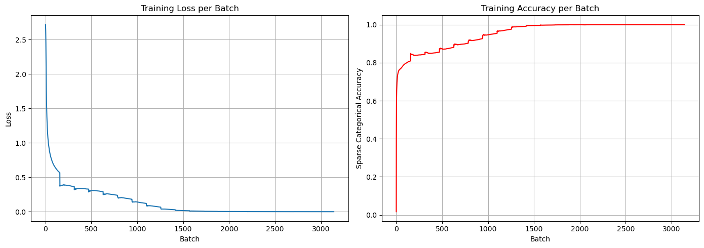

# Project Evolution

I start trying overfitting. So I set all the iperparams hight.
- optimizer="adam",
- loss="sparse_categorical_crossentropy",
- metrics=["sparse_categorical_accuracy"]
- EARLY STOPPING 1  
    monitor="val_loss",  
    patience=5,  
    min_delta=0.003  
- EARLY STOPPING 2  
    monitor="val_prefix_acc",  
    mode="max",  
    patience=5,  
    min_delta=0.001

- **FIXED**:  
    |train| = 10_000  
    | val | = 1_000
    |val_b| = 1_000 unseen data

---

# Model 1.8M 
model_v1.check_16

## Hyperparameters
- **embed_dim**: 32
- **enc_units**: 256
- **dec_units**: 256
- **batch_size**: 16

## Output di cells
### training
```
Epoch 001 | Loss: 0.4081 | Accuracy: 0.8413 | Val Loss: 0.2906 | Val Accuracy: 0.4201 | Val B Loss: 0.4244 | Val B Accuracy: 0.8213 | Prefix Acc: 0.4201
Epoch 002 | Loss: 0.2161 | Accuracy: 0.9125 | Val Loss: 0.1255 | Val Accuracy: 0.7809 | Val B Loss: 0.2116 | Val B Accuracy: 0.9191 | Prefix Acc: 0.7809
Epoch 003 | Loss: 0.0610 | Accuracy: 0.9787 | Val Loss: 0.0164 | Val Accuracy: 0.9748 | Val B Loss: 0.0301 | Val B Accuracy: 0.9911 | Prefix Acc: 0.9748
Epoch 004 | Loss: 0.0060 | Accuracy: 0.9988 | Val Loss: 0.0013 | Val Accuracy: 1.0000 | Val B Loss: 0.0022 | Val B Accuracy: 1.0000 | Prefix Acc: 1.0000
Epoch 005 | Loss: 0.0007 | Accuracy: 1.0000 | Val Loss: 0.0004 | Val Accuracy: 1.0000 | Val B Loss: 0.0008 | Val B Accuracy: 1.0000 | Prefix Acc: 1.0000
Epoch 006 | Loss: 0.0003 | Accuracy: 1.0000 | Val Loss: 0.0002 | Val Accuracy: 1.0000 | Val B Loss: 0.0004 | Val B Accuracy: 1.0000 | Prefix Acc: 1.0000
Epoch 007 | Loss: 0.0002 | Accuracy: 1.0000 | Val Loss: 0.0001 | Val Accuracy: 1.0000 | Val B Loss: 0.0003 | Val B Accuracy: 1.0000 | Prefix Acc: 1.0000
Epoch 008 | Loss: 0.0001 | Accuracy: 1.0000 | Val Loss: 0.0001 | Val Accuracy: 1.0000 | Val B Loss: 0.0002 | Val B Accuracy: 1.0000 | Prefix Acc: 1.0000
Epoch 009 | Loss: 0.0001 | Accuracy: 1.0000 | Val Loss: 0.0001 | Val Accuracy: 1.0000 | Val B Loss: 0.0001 | Val B Accuracy: 1.0000 | Prefix Acc: 1.0000
Training stopped by: val_loss
Training stopped by: val_prefix_acc
```

### test
```
Testing autoregressive decoding with 20 samples...
================================================
FINAL SCORE = 1.0000 STD = 0.0000
Testing autoregressive decoding with 20 samples...
================================================
FINAL SCORE = 1.0000 STD = 0.0000
Testing autoregressive decoding with 20 samples...
================================================
FINAL SCORE = 1.0000 STD = 0.0000
Testing autoregressive decoding with 20 samples...
================================================
FINAL SCORE = 1.0000 STD = 0.0000
Testing autoregressive decoding with 20 samples...
================================================
FINAL SCORE = 1.0000 STD = 0.0000
```

### test_Depth
```

~~~~~~~~~~Testing with max_depth=4~~~~~~~~~~~~
================================================
FINAL SCORE = 0.4463 STD = 0.0733

~~~~~~~~~~Testing with max_depth=5~~~~~~~~~~~~
================================================
FINAL SCORE = 0.2432 STD = 0.0528

~~~~~~~~~~Testing with max_depth=6~~~~~~~~~~~~
================================================
FINAL SCORE = 0.1675 STD = 0.0429

~~~~~~~~~~Testing with max_depth=8~~~~~~~~~~~~
================================================
FINAL SCORE = 0.0639 STD = 0.0165
```

## Figures
### epoch


### batch


---

# MODEL 500k

## Hyperparameters
- **embed_dim**: 32
- **enc_units**: 128
- **dec_units**: 128
- **batch_size**: 16

## Output di cells
### training
```
Epoch 001 | Loss: 0.4232 | Accuracy: 0.8369 | Val Loss: 0.2916 | Val Accuracy: 0.3265 | Val B Loss: 0.4490 | Val B Accuracy: 0.8173 | Prefix Acc: 0.3265
Epoch 002 | Loss: 0.2304 | Accuracy: 0.9063 | Val Loss: 0.1534 | Val Accuracy: 0.6736 | Val B Loss: 0.2771 | Val B Accuracy: 0.8860 | Prefix Acc: 0.6736
Epoch 003 | Loss: 0.0988 | Accuracy: 0.9639 | Val Loss: 0.0369 | Val Accuracy: 0.9491 | Val B Loss: 0.0758 | Val B Accuracy: 0.9769 | Prefix Acc: 0.9491
Epoch 004 | Loss: 0.0192 | Accuracy: 0.9956 | Val Loss: 0.0063 | Val Accuracy: 0.9902 | Val B Loss: 0.0133 | Val B Accuracy: 0.9980 | Prefix Acc: 0.9902
Epoch 005 | Loss: 0.0042 | Accuracy: 0.9995 | Val Loss: 0.0012 | Val Accuracy: 1.0000 | Val B Loss: 0.0026 | Val B Accuracy: 1.0000 | Prefix Acc: 1.0000
Epoch 006 | Loss: 0.0012 | Accuracy: 0.9999 | Val Loss: 0.0005 | Val Accuracy: 1.0000 | Val B Loss: 0.0012 | Val B Accuracy: 1.0000 | Prefix Acc: 1.0000
Epoch 007 | Loss: 0.0005 | Accuracy: 1.0000 | Val Loss: 0.0003 | Val Accuracy: 1.0000 | Val B Loss: 0.0006 | Val B Accuracy: 1.0000 | Prefix Acc: 1.0000
Epoch 008 | Loss: 0.0003 | Accuracy: 1.0000 | Val Loss: 0.0002 | Val Accuracy: 1.0000 | Val B Loss: 0.0004 | Val B Accuracy: 1.0000 | Prefix Acc: 1.0000
Epoch 009 | Loss: 0.0002 | Accuracy: 1.0000 | Val Loss: 0.0001 | Val Accuracy: 1.0000 | Val B Loss: 0.0003 | Val B Accuracy: 1.0000 | Prefix Acc: 1.0000
Epoch 010 | Loss: 0.0001 | Accuracy: 1.0000 | Val Loss: 0.0001 | Val Accuracy: 1.0000 | Val B Loss: 0.0002 | Val B Accuracy: 1.0000 | Prefix Acc: 1.0000
Training stopped by: val_loss
Training stopped by: val_prefix_acc
```

### test
```
Testing autoregressive decoding with 20 samples...
================================================
FINAL SCORE = 1.0000 STD = 0.0000
Testing autoregressive decoding with 20 samples...
================================================
FINAL SCORE = 1.0000 STD = 0.0000
Testing autoregressive decoding with 20 samples...
================================================
FINAL SCORE = 1.0000 STD = 0.0000
Testing autoregressive decoding with 20 samples...
================================================
FINAL SCORE = 1.0000 STD = 0.0000
Testing autoregressive decoding with 20 samples...
================================================
FINAL SCORE = 1.0000 STD = 0.0000
```

### test_Depth
```

~~~~~~~~~~Testing with max_depth=4~~~~~~~~~~~~
================================================
FINAL SCORE = 0.2182 STD = 0.0487

~~~~~~~~~~Testing with max_depth=5~~~~~~~~~~~~
================================================
FINAL SCORE = 0.0998 STD = 0.0290

~~~~~~~~~~Testing with max_depth=6~~~~~~~~~~~~
================================================
FINAL SCORE = 0.0584 STD = 0.0377
```

## Figures
### epoch


### batch


---

# MODEL 132k 
model_v4.0  
usato come early stopping val_b_loss
es = NamedEarlyStopping(
    name="val_b_loss",
    monitor="val_b_loss",
    mode="min",
    patience=10,
    min_delta=0.001, # we espect more improvments in loss
    restore_best_weights=True
)

es_prefix = NamedEarlyStopping(
    name="val_prefix_acc",
    monitor="val_prefix_acc",
    mode="max",
    patience=10,
    restore_best_weights=True
)

## Hyperparameters
- **embed_dim**: 16
- **enc_units**: 64
- **dec_units**: 64
- **batch_size**: 16

## Output di cells
### training
```
Epoch 001 | Loss: 0.4658 | Accuracy: 0.8271 | Val Loss: 0.3579 | Val Accuracy: 0.1820 | Val B Loss: 0.4968 | Val B Accuracy: 0.7851 | Prefix Acc: 0.1820
Epoch 002 | Loss: 0.3202 | Accuracy: 0.8642 | Val Loss: 0.2948 | Val Accuracy: 0.3784 | Val B Loss: 0.4149 | Val B Accuracy: 0.8303 | Prefix Acc: 0.3784
Epoch 003 | Loss: 0.2513 | Accuracy: 0.8985 | Val Loss: 0.2312 | Val Accuracy: 0.5096 | Val B Loss: 0.3428 | Val B Accuracy: 0.8585 | Prefix Acc: 0.5096
Epoch 004 | Loss: 0.1760 | Accuracy: 0.9323 | Val Loss: 0.1411 | Val Accuracy: 0.7351 | Val B Loss: 0.2190 | Val B Accuracy: 0.9201 | Prefix Acc: 0.7351
Epoch 005 | Loss: 0.0996 | Accuracy: 0.9657 | Val Loss: 0.0746 | Val Accuracy: 0.8504 | Val B Loss: 0.1198 | Val B Accuracy: 0.9590 | Prefix Acc: 0.8504
Epoch 006 | Loss: 0.0485 | Accuracy: 0.9857 | Val Loss: 0.0324 | Val Accuracy: 0.9393 | Val B Loss: 0.0529 | Val B Accuracy: 0.9869 | Prefix Acc: 0.9393
Epoch 007 | Loss: 0.0210 | Accuracy: 0.9953 | Val Loss: 0.0128 | Val Accuracy: 0.9842 | Val B Loss: 0.0217 | Val B Accuracy: 0.9961 | Prefix Acc: 0.9842
Epoch 008 | Loss: 0.0082 | Accuracy: 0.9989 | Val Loss: 0.0051 | Val Accuracy: 0.9940 | Val B Loss: 0.0084 | Val B Accuracy: 0.9992 | Prefix Acc: 0.9940
Epoch 009 | Loss: 0.0032 | Accuracy: 0.9998 | Val Loss: 0.0022 | Val Accuracy: 0.9956 | Val B Loss: 0.0038 | Val B Accuracy: 0.9998 | Prefix Acc: 0.9956
Epoch 010 | Loss: 0.0019 | Accuracy: 0.9999 | Val Loss: 0.0012 | Val Accuracy: 1.0000 | Val B Loss: 0.0020 | Val B Accuracy: 1.0000 | Prefix Acc: 1.0000
Epoch 011 | Loss: 0.0008 | Accuracy: 1.0000 | Val Loss: 0.0007 | Val Accuracy: 1.0000 | Val B Loss: 0.0011 | Val B Accuracy: 1.0000 | Prefix Acc: 1.0000
Epoch 012 | Loss: 0.0005 | Accuracy: 1.0000 | Val Loss: 0.0004 | Val Accuracy: 1.0000 | Val B Loss: 0.0007 | Val B Accuracy: 1.0000 | Prefix Acc: 1.0000
Epoch 013 | Loss: 0.0003 | Accuracy: 1.0000 | Val Loss: 0.0003 | Val Accuracy: 1.0000 | Val B Loss: 0.0004 | Val B Accuracy: 1.0000 | Prefix Acc: 1.0000
Epoch 014 | Loss: 0.0002 | Accuracy: 1.0000 | Val Loss: 0.0002 | Val Accuracy: 1.0000 | Val B Loss: 0.0003 | Val B Accuracy: 1.0000 | Prefix Acc: 1.0000
Epoch 015 | Loss: 0.0001 | Accuracy: 1.0000 | Val Loss: 0.0001 | Val Accuracy: 1.0000 | Val B Loss: 0.0002 | Val B Accuracy: 1.0000 | Prefix Acc: 1.0000
Epoch 016 | Loss: 0.0001 | Accuracy: 1.0000 | Val Loss: 0.0001 | Val Accuracy: 1.0000 | Val B Loss: 0.0001 | Val B Accuracy: 1.0000 | Prefix Acc: 1.0000
Epoch 017 | Loss: 0.0001 | Accuracy: 1.0000 | Val Loss: 0.0001 | Val Accuracy: 1.0000 | Val B Loss: 0.0001 | Val B Accuracy: 1.0000 | Prefix Acc: 1.0000
Epoch 018 | Loss: 0.0000 | Accuracy: 1.0000 | Val Loss: 0.0000 | Val Accuracy: 1.0000 | Val B Loss: 0.0001 | Val B Accuracy: 1.0000 | Prefix Acc: 1.0000
Epoch 019 | Loss: 0.0000 | Accuracy: 1.0000 | Val Loss: 0.0000 | Val Accuracy: 1.0000 | Val B Loss: 0.0000 | Val B Accuracy: 1.0000 | Prefix Acc: 1.0000
Epoch 020 | Loss: 0.0000 | Accuracy: 1.0000 | Val Loss: 0.0000 | Val Accuracy: 1.0000 | Val B Loss: 0.0000 | Val B Accuracy: 1.0000 | Prefix Acc: 1.0000
Training stopped by: None
Training stopped by: val_prefix_acc
```

### test
```
Testing autoregressive decoding with 20 samples...
================================================
FINAL SCORE = 1.0000 STD = 0.0000
Testing autoregressive decoding with 20 samples...
================================================
FINAL SCORE = 1.0000 STD = 0.0000
Testing autoregressive decoding with 20 samples...
================================================
FINAL SCORE = 1.0000 STD = 0.0000
Testing autoregressive decoding with 20 samples...
================================================
FINAL SCORE = 1.0000 STD = 0.0000
Testing autoregressive decoding with 20 samples...
================================================
FINAL SCORE = 1.0000 STD = 0.0000
```

### test_Depth
```

~~~~~~~~~~Testing with max_depth=4~~~~~~~~~~~~
================================================
FINAL SCORE = 0.4229 STD = 0.0663

~~~~~~~~~~Testing with max_depth=5~~~~~~~~~~~~
================================================
FINAL SCORE = 0.1406 STD = 0.0232

~~~~~~~~~~Testing with max_depth=6~~~~~~~~~~~~
================================================
FINAL SCORE = 0.0571 STD = 0.0234
```

## Figures
### epoch


### batch


---

# MODEL 42k 

## Hyperparameters
- **embed_dim**: 16
- **enc_units**: 32
- **dec_units**: 32
- **batch_size**: 16

## Output di cells
### training
```
Epoch 001 | Loss: 0.5069 | Accuracy: 0.8279 | Val Loss: 0.3371 | Val Accuracy: 0.3092 | Val B Loss: 0.4931 | Val B Accuracy: 0.7978 | Prefix Acc: 0.3092
Epoch 002 | Loss: 0.3015 | Accuracy: 0.8810 | Val Loss: 0.2671 | Val Accuracy: 0.4911 | Val B Loss: 0.4067 | Val B Accuracy: 0.8382 | Prefix Acc: 0.4911
Epoch 003 | Loss: 0.2429 | Accuracy: 0.9048 | Val Loss: 0.2178 | Val Accuracy: 0.5703 | Val B Loss: 0.3490 | Val B Accuracy: 0.8593 | Prefix Acc: 0.5703
Epoch 004 | Loss: 0.2000 | Accuracy: 0.9217 | Val Loss: 0.1776 | Val Accuracy: 0.6001 | Val B Loss: 0.2956 | Val B Accuracy: 0.8867 | Prefix Acc: 0.6001
Epoch 005 | Loss: 0.1597 | Accuracy: 0.9423 | Val Loss: 0.1415 | Val Accuracy: 0.7055 | Val B Loss: 0.2425 | Val B Accuracy: 0.9121 | Prefix Acc: 0.7055
Epoch 006 | Loss: 0.1228 | Accuracy: 0.9603 | Val Loss: 0.1062 | Val Accuracy: 0.8033 | Val B Loss: 0.1866 | Val B Accuracy: 0.9367 | Prefix Acc: 0.8033
Epoch 007 | Loss: 0.0885 | Accuracy: 0.9738 | Val Loss: 0.0708 | Val Accuracy: 0.8568 | Val B Loss: 0.1298 | Val B Accuracy: 0.9596 | Prefix Acc: 0.8568
Epoch 008 | Loss: 0.0616 | Accuracy: 0.9822 | Val Loss: 0.0492 | Val Accuracy: 0.9050 | Val B Loss: 0.0925 | Val B Accuracy: 0.9732 | Prefix Acc: 0.9050
Epoch 009 | Loss: 0.0437 | Accuracy: 0.9881 | Val Loss: 0.0368 | Val Accuracy: 0.9433 | Val B Loss: 0.0695 | Val B Accuracy: 0.9805 | Prefix Acc: 0.9433
Epoch 010 | Loss: 0.0312 | Accuracy: 0.9918 | Val Loss: 0.0268 | Val Accuracy: 0.9622 | Val B Loss: 0.0509 | Val B Accuracy: 0.9870 | Prefix Acc: 0.9622
Epoch 011 | Loss: 0.0215 | Accuracy: 0.9950 | Val Loss: 0.0186 | Val Accuracy: 0.9737 | Val B Loss: 0.0354 | Val B Accuracy: 0.9921 | Prefix Acc: 0.9737
Epoch 012 | Loss: 0.0148 | Accuracy: 0.9970 | Val Loss: 0.0126 | Val Accuracy: 0.9769 | Val B Loss: 0.0237 | Val B Accuracy: 0.9956 | Prefix Acc: 0.9769
Epoch 013 | Loss: 0.0105 | Accuracy: 0.9981 | Val Loss: 0.0090 | Val Accuracy: 0.9899 | Val B Loss: 0.0168 | Val B Accuracy: 0.9970 | Prefix Acc: 0.9899
Epoch 014 | Loss: 0.0075 | Accuracy: 0.9989 | Val Loss: 0.0062 | Val Accuracy: 0.9922 | Val B Loss: 0.0117 | Val B Accuracy: 0.9981 | Prefix Acc: 0.9922
Epoch 015 | Loss: 0.0052 | Accuracy: 0.9993 | Val Loss: 0.0044 | Val Accuracy: 0.9907 | Val B Loss: 0.0082 | Val B Accuracy: 0.9990 | Prefix Acc: 0.9907
Epoch 016 | Loss: 0.0036 | Accuracy: 0.9996 | Val Loss: 0.0033 | Val Accuracy: 0.9925 | Val B Loss: 0.0061 | Val B Accuracy: 0.9992 | Prefix Acc: 0.9925
Epoch 017 | Loss: 0.0024 | Accuracy: 0.9999 | Val Loss: 0.0024 | Val Accuracy: 0.9943 | Val B Loss: 0.0045 | Val B Accuracy: 0.9993 | Prefix Acc: 0.9943
Epoch 018 | Loss: 0.0017 | Accuracy: 0.9999 | Val Loss: 0.0017 | Val Accuracy: 0.9959 | Val B Loss: 0.0033 | Val B Accuracy: 0.9996 | Prefix Acc: 0.9959
Epoch 019 | Loss: 0.0012 | Accuracy: 1.0000 | Val Loss: 0.0013 | Val Accuracy: 0.9959 | Val B Loss: 0.0025 | Val B Accuracy: 0.9997 | Prefix Acc: 0.9959
Epoch 020 | Loss: 0.0022 | Accuracy: 0.9996 | Val Loss: 0.0009 | Val Accuracy: 0.9985 | Val B Loss: 0.0016 | Val B Accuracy: 0.9999 | Prefix Acc: 0.9985
Epoch 021 | Loss: 0.0006 | Accuracy: 1.0000 | Val Loss: 0.0006 | Val Accuracy: 0.9985 | Val B Loss: 0.0010 | Val B Accuracy: 0.9999 | Prefix Acc: 0.9985
Epoch 022 | Loss: 0.0004 | Accuracy: 1.0000 | Val Loss: 0.0004 | Val Accuracy: 0.9985 | Val B Loss: 0.0008 | Val B Accuracy: 1.0000 | Prefix Acc: 0.9985
Epoch 023 | Loss: 0.0003 | Accuracy: 1.0000 | Val Loss: 0.0003 | Val Accuracy: 1.0000 | Val B Loss: 0.0006 | Val B Accuracy: 1.0000 | Prefix Acc: 1.0000
Epoch 024 | Loss: 0.0002 | Accuracy: 1.0000 | Val Loss: 0.0003 | Val Accuracy: 1.0000 | Val B Loss: 0.0005 | Val B Accuracy: 1.0000 | Prefix Acc: 1.0000
Epoch 025 | Loss: 0.0002 | Accuracy: 1.0000 | Val Loss: 0.0002 | Val Accuracy: 1.0000 | Val B Loss: 0.0004 | Val B Accuracy: 1.0000 | Prefix Acc: 1.0000
Epoch 026 | Loss: 0.0001 | Accuracy: 1.0000 | Val Loss: 0.0002 | Val Accuracy: 1.0000 | Val B Loss: 0.0003 | Val B Accuracy: 1.0000 | Prefix Acc: 1.0000
Epoch 027 | Loss: 0.0001 | Accuracy: 1.0000 | Val Loss: 0.0001 | Val Accuracy: 1.0000 | Val B Loss: 0.0002 | Val B Accuracy: 1.0000 | Prefix Acc: 1.0000
Epoch 028 | Loss: 0.0001 | Accuracy: 1.0000 | Val Loss: 0.0001 | Val Accuracy: 1.0000 | Val B Loss: 0.0001 | Val B Accuracy: 1.0000 | Prefix Acc: 1.0000
Epoch 029 | Loss: 0.0000 | Accuracy: 1.0000 | Val Loss: 0.0001 | Val Accuracy: 1.0000 | Val B Loss: 0.0001 | Val B Accuracy: 1.0000 | Prefix Acc: 1.0000
Epoch 030 | Loss: 0.0000 | Accuracy: 1.0000 | Val Loss: 0.0000 | Val Accuracy: 1.0000 | Val B Loss: 0.0001 | Val B Accuracy: 1.0000 | Prefix Acc: 1.0000
Epoch 031 | Loss: 0.0000 | Accuracy: 1.0000 | Val Loss: 0.0000 | Val Accuracy: 1.0000 | Val B Loss: 0.0000 | Val B Accuracy: 1.0000 | Prefix Acc: 1.0000
Epoch 032 | Loss: 0.0000 | Accuracy: 1.0000 | Val Loss: 0.0000 | Val Accuracy: 1.0000 | Val B Loss: 0.0000 | Val B Accuracy: 1.0000 | Prefix Acc: 1.0000
Epoch 033 | Loss: 0.0000 | Accuracy: 1.0000 | Val Loss: 0.0000 | Val Accuracy: 1.0000 | Val B Loss: 0.0000 | Val B Accuracy: 1.0000 | Prefix Acc: 1.0000
Training stopped by: None
Training stopped by: val_prefix_acc
```

### test
```
Testing autoregressive decoding with 20 samples...
================================================
FINAL SCORE = 1.0000 STD = 0.0000
Testing autoregressive decoding with 20 samples...
================================================
FINAL SCORE = 1.0000 STD = 0.0000
Testing autoregressive decoding with 20 samples...
================================================
FINAL SCORE = 1.0000 STD = 0.0000
Testing autoregressive decoding with 20 samples...
================================================
FINAL SCORE = 1.0000 STD = 0.0000
Testing autoregressive decoding with 20 samples...
================================================
FINAL SCORE = 1.0000 STD = 0.0000
```

### test_Depth
```

~~~~~~~~~~Testing with max_depth=4~~~~~~~~~~~~
================================================
FINAL SCORE = 0.3660 STD = 0.0308

~~~~~~~~~~Testing with max_depth=5~~~~~~~~~~~~
================================================
FINAL SCORE = 0.1031 STD = 0.0331

~~~~~~~~~~Testing with max_depth=6~~~~~~~~~~~~
================================================
FINAL SCORE = 0.0232 STD = 0.0220
```

## Figures
### epoch


### batch


---
---
start try with drop-out

# model_dropout_256_batch

questo e' stato fatto per verificare se il batch size potesse migliorare le prestazioni del modello a depth mai viste con 
dropout=0.2,           # 20% sulle connessioni input→cella
recurrent_dropout=0.2, # 20% sulle connessioni h_{t-1}→cella
sia  in encoding LSTM che decoding 
e un x = SpatialDropout1D(0.15)(x) dopo gli embedding

## Hyperparameters
- **embed_dim**: 32
- **enc_units**: 256
- **dec_units**: 256
- **batch_size**: 256

## Output di cells
### training
```
Epoch 001 | Loss: 0.8409 | Accuracy: 0.7706 | Val Loss: 0.4991 | Val Accuracy: 0.0932 | Val B Loss: 0.6724 | Val B Accuracy: 0.7354 | Prefix Acc: 0.0932
Epoch 002 | Loss: 0.4655 | Accuracy: 0.8223 | Val Loss: 0.4204 | Val Accuracy: 0.0951 | Val B Loss: 0.5870 | Val B Accuracy: 0.7612 | Prefix Acc: 0.0951
Epoch 003 | Loss: 0.4129 | Accuracy: 0.8329 | Val Loss: 0.3824 | Val Accuracy: 0.1608 | Val B Loss: 0.5415 | Val B Accuracy: 0.7759 | Prefix Acc: 0.1608
Epoch 004 | Loss: 0.3801 | Accuracy: 0.8416 | Val Loss: 0.3604 | Val Accuracy: 0.1741 | Val B Loss: 0.5128 | Val B Accuracy: 0.7808 | Prefix Acc: 0.1741
Epoch 005 | Loss: 0.3544 | Accuracy: 0.8491 | Val Loss: 0.3318 | Val Accuracy: 0.2572 | Val B Loss: 0.4702 | Val B Accuracy: 0.8040 | Prefix Acc: 0.2572
Epoch 006 | Loss: 0.3339 | Accuracy: 0.8601 | Val Loss: 0.3141 | Val Accuracy: 0.2893 | Val B Loss: 0.4463 | Val B Accuracy: 0.8177 | Prefix Acc: 0.2893
Epoch 007 | Loss: 0.3166 | Accuracy: 0.8690 | Val Loss: 0.2941 | Val Accuracy: 0.4507 | Val B Loss: 0.4218 | Val B Accuracy: 0.8257 | Prefix Acc: 0.4507
Epoch 008 | Loss: 0.3038 | Accuracy: 0.8747 | Val Loss: 0.2803 | Val Accuracy: 0.4842 | Val B Loss: 0.4037 | Val B Accuracy: 0.8342 | Prefix Acc: 0.4842
Epoch 009 | Loss: 0.2894 | Accuracy: 0.8819 | Val Loss: 0.2668 | Val Accuracy: 0.4981 | Val B Loss: 0.3870 | Val B Accuracy: 0.8409 | Prefix Acc: 0.4981
Epoch 010 | Loss: 0.2725 | Accuracy: 0.8901 | Val Loss: 0.2492 | Val Accuracy: 0.5189 | Val B Loss: 0.3664 | Val B Accuracy: 0.8500 | Prefix Acc: 0.5189
Epoch 011 | Loss: 0.2487 | Accuracy: 0.9002 | Val Loss: 0.2125 | Val Accuracy: 0.5767 | Val B Loss: 0.3161 | Val B Accuracy: 0.8725 | Prefix Acc: 0.5767
Epoch 012 | Loss: 0.2206 | Accuracy: 0.9117 | Val Loss: 0.1894 | Val Accuracy: 0.6197 | Val B Loss: 0.2893 | Val B Accuracy: 0.8798 | Prefix Acc: 0.6197
Epoch 013 | Loss: 0.1947 | Accuracy: 0.9215 | Val Loss: 0.1649 | Val Accuracy: 0.6752 | Val B Loss: 0.2588 | Val B Accuracy: 0.8951 | Prefix Acc: 0.6752
Epoch 014 | Loss: 0.1703 | Accuracy: 0.9327 | Val Loss: 0.1351 | Val Accuracy: 0.7223 | Val B Loss: 0.2171 | Val B Accuracy: 0.9148 | Prefix Acc: 0.7223
Epoch 015 | Loss: 0.1456 | Accuracy: 0.9440 | Val Loss: 0.1117 | Val Accuracy: 0.7382 | Val B Loss: 0.1840 | Val B Accuracy: 0.9296 | Prefix Acc: 0.7382
Epoch 016 | Loss: 0.1237 | Accuracy: 0.9534 | Val Loss: 0.0925 | Val Accuracy: 0.7900 | Val B Loss: 0.1546 | Val B Accuracy: 0.9411 | Prefix Acc: 0.7900
Epoch 017 | Loss: 0.1044 | Accuracy: 0.9609 | Val Loss: 0.0732 | Val Accuracy: 0.8488 | Val B Loss: 0.1249 | Val B Accuracy: 0.9548 | Prefix Acc: 0.8488
Epoch 018 | Loss: 0.0850 | Accuracy: 0.9686 | Val Loss: 0.0553 | Val Accuracy: 0.8968 | Val B Loss: 0.0966 | Val B Accuracy: 0.9665 | Prefix Acc: 0.8968
Epoch 019 | Loss: 0.0676 | Accuracy: 0.9764 | Val Loss: 0.0416 | Val Accuracy: 0.9106 | Val B Loss: 0.0741 | Val B Accuracy: 0.9751 | Prefix Acc: 0.9106
Epoch 020 | Loss: 0.0530 | Accuracy: 0.9824 | Val Loss: 0.0284 | Val Accuracy: 0.9592 | Val B Loss: 0.0518 | Val B Accuracy: 0.9845 | Prefix Acc: 0.9592
Epoch 021 | Loss: 0.0385 | Accuracy: 0.9886 | Val Loss: 0.0176 | Val Accuracy: 0.9759 | Val B Loss: 0.0327 | Val B Accuracy: 0.9914 | Prefix Acc: 0.9759
Epoch 022 | Loss: 0.0285 | Accuracy: 0.9922 | Val Loss: 0.0122 | Val Accuracy: 0.9759 | Val B Loss: 0.0223 | Val B Accuracy: 0.9949 | Prefix Acc: 0.9759
Epoch 023 | Loss: 0.0210 | Accuracy: 0.9947 | Val Loss: 0.0090 | Val Accuracy: 0.9798 | Val B Loss: 0.0162 | Val B Accuracy: 0.9965 | Prefix Acc: 0.9798
Epoch 024 | Loss: 0.0162 | Accuracy: 0.9962 | Val Loss: 0.0053 | Val Accuracy: 0.9944 | Val B Loss: 0.0099 | Val B Accuracy: 0.9985 | Prefix Acc: 0.9944
Epoch 025 | Loss: 0.0126 | Accuracy: 0.9973 | Val Loss: 0.0035 | Val Accuracy: 0.9992 | Val B Loss: 0.0064 | Val B Accuracy: 0.9994 | Prefix Acc: 0.9992
Epoch 026 | Loss: 0.0090 | Accuracy: 0.9984 | Val Loss: 0.0028 | Val Accuracy: 1.0000 | Val B Loss: 0.0048 | Val B Accuracy: 0.9997 | Prefix Acc: 1.0000
Epoch 027 | Loss: 0.0074 | Accuracy: 0.9989 | Val Loss: 0.0025 | Val Accuracy: 0.9982 | Val B Loss: 0.0044 | Val B Accuracy: 0.9994 | Prefix Acc: 0.9982
Epoch 028 | Loss: 0.0062 | Accuracy: 0.9990 | Val Loss: 0.0016 | Val Accuracy: 1.0000 | Val B Loss: 0.0027 | Val B Accuracy: 0.9999 | Prefix Acc: 1.0000
Epoch 029 | Loss: 0.0050 | Accuracy: 0.9993 | Val Loss: 0.0012 | Val Accuracy: 1.0000 | Val B Loss: 0.0020 | Val B Accuracy: 0.9999 | Prefix Acc: 1.0000
Epoch 030 | Loss: 0.0044 | Accuracy: 0.9994 | Val Loss: 0.0009 | Val Accuracy: 1.0000 | Val B Loss: 0.0014 | Val B Accuracy: 1.0000 | Prefix Acc: 1.0000
Training stopped by: None
Training stopped by: val_prefix_acc
```

### test
```
Testing autoregressive decoding with 20 samples...
================================================
FINAL SCORE = 1.0000 STD = 0.0000
Testing autoregressive decoding with 20 samples...
================================================
FINAL SCORE = 0.9996 STD = 0.0012
Testing autoregressive decoding with 20 samples...
================================================
FINAL SCORE = 0.9995 STD = 0.0014
Testing autoregressive decoding with 20 samples...
================================================
FINAL SCORE = 0.9992 STD = 0.0023
Testing autoregressive decoding with 20 samples...
================================================
FINAL SCORE = 1.0000 STD = 0.0000
```

### test_Depth
```

~~~~~~~~~~Testing with max_depth=4~~~~~~~~~~~~
================================================
FINAL SCORE = 0.4224 STD = 0.0539

~~~~~~~~~~Testing with max_depth=5~~~~~~~~~~~~
================================================
FINAL SCORE = 0.1776 STD = 0.0372

~~~~~~~~~~Testing with max_depth=6~~~~~~~~~~~~
================================================
FINAL SCORE = 0.1241 STD = 0.0291
```

## Figures
### epoch


### batch


---

# Final model for the dropout metod
model_dropout_256_last_batch

## Hyperparameters
- **embed_dim**: 32
- **enc_units**: 256
- **dec_units**: 256
- **batch_size**: 256

## Output di cells
### training
```
Epoch 001 | Loss: 0.8288 | Accuracy: 0.7754 | Val Loss: 0.5165 | Val Accuracy: 0.0756 | Val B Loss: 0.6770 | Val B Accuracy: 0.7380 | Prefix Acc: 0.0756
Epoch 002 | Loss: 0.4706 | Accuracy: 0.8219 | Val Loss: 0.4375 | Val Accuracy: 0.1028 | Val B Loss: 0.5948 | Val B Accuracy: 0.7615 | Prefix Acc: 0.1028
Epoch 003 | Loss: 0.4191 | Accuracy: 0.8317 | Val Loss: 0.4027 | Val Accuracy: 0.1080 | Val B Loss: 0.5563 | Val B Accuracy: 0.7685 | Prefix Acc: 0.1080
Epoch 004 | Loss: 0.3879 | Accuracy: 0.8395 | Val Loss: 0.3827 | Val Accuracy: 0.1308 | Val B Loss: 0.5310 | Val B Accuracy: 0.7757 | Prefix Acc: 0.1308
Epoch 005 | Loss: 0.3616 | Accuracy: 0.8456 | Val Loss: 0.3515 | Val Accuracy: 0.1606 | Val B Loss: 0.4842 | Val B Accuracy: 0.7947 | Prefix Acc: 0.1606
Epoch 006 | Loss: 0.3428 | Accuracy: 0.8514 | Val Loss: 0.3390 | Val Accuracy: 0.2157 | Val B Loss: 0.4666 | Val B Accuracy: 0.8066 | Prefix Acc: 0.2157
Epoch 007 | Loss: 0.3270 | Accuracy: 0.8637 | Val Loss: 0.3116 | Val Accuracy: 0.3567 | Val B Loss: 0.4275 | Val B Accuracy: 0.8251 | Prefix Acc: 0.3567
Epoch 008 | Loss: 0.3062 | Accuracy: 0.8779 | Val Loss: 0.2870 | Val Accuracy: 0.3963 | Val B Loss: 0.3988 | Val B Accuracy: 0.8404 | Prefix Acc: 0.3963
Epoch 009 | Loss: 0.2800 | Accuracy: 0.8902 | Val Loss: 0.2547 | Val Accuracy: 0.5351 | Val B Loss: 0.3615 | Val B Accuracy: 0.8516 | Prefix Acc: 0.5351
Epoch 010 | Loss: 0.2536 | Accuracy: 0.8997 | Val Loss: 0.2269 | Val Accuracy: 0.5651 | Val B Loss: 0.3298 | Val B Accuracy: 0.8625 | Prefix Acc: 0.5651
Epoch 011 | Loss: 0.2290 | Accuracy: 0.9075 | Val Loss: 0.1989 | Val Accuracy: 0.6001 | Val B Loss: 0.2945 | Val B Accuracy: 0.8781 | Prefix Acc: 0.6001
Epoch 012 | Loss: 0.2028 | Accuracy: 0.9164 | Val Loss: 0.1760 | Val Accuracy: 0.6304 | Val B Loss: 0.2655 | Val B Accuracy: 0.8892 | Prefix Acc: 0.6304
Epoch 013 | Loss: 0.1814 | Accuracy: 0.9253 | Val Loss: 0.1532 | Val Accuracy: 0.7051 | Val B Loss: 0.2345 | Val B Accuracy: 0.9075 | Prefix Acc: 0.7051
Epoch 014 | Loss: 0.1599 | Accuracy: 0.9364 | Val Loss: 0.1280 | Val Accuracy: 0.7464 | Val B Loss: 0.2016 | Val B Accuracy: 0.9222 | Prefix Acc: 0.7464
Epoch 015 | Loss: 0.1364 | Accuracy: 0.9486 | Val Loss: 0.1058 | Val Accuracy: 0.7870 | Val B Loss: 0.1696 | Val B Accuracy: 0.9353 | Prefix Acc: 0.7870
Epoch 016 | Loss: 0.1147 | Accuracy: 0.9570 | Val Loss: 0.0847 | Val Accuracy: 0.8294 | Val B Loss: 0.1376 | Val B Accuracy: 0.9475 | Prefix Acc: 0.8294
Epoch 017 | Loss: 0.0941 | Accuracy: 0.9652 | Val Loss: 0.0639 | Val Accuracy: 0.9041 | Val B Loss: 0.1054 | Val B Accuracy: 0.9613 | Prefix Acc: 0.9041
Epoch 018 | Loss: 0.0733 | Accuracy: 0.9737 | Val Loss: 0.0441 | Val Accuracy: 0.9575 | Val B Loss: 0.0732 | Val B Accuracy: 0.9763 | Prefix Acc: 0.9575
Epoch 019 | Loss: 0.0552 | Accuracy: 0.9817 | Val Loss: 0.0294 | Val Accuracy: 0.9718 | Val B Loss: 0.0484 | Val B Accuracy: 0.9870 | Prefix Acc: 0.9718
Epoch 020 | Loss: 0.0397 | Accuracy: 0.9883 | Val Loss: 0.0199 | Val Accuracy: 0.9886 | Val B Loss: 0.0320 | Val B Accuracy: 0.9922 | Prefix Acc: 0.9886
Epoch 021 | Loss: 0.0300 | Accuracy: 0.9916 | Val Loss: 0.0140 | Val Accuracy: 0.9959 | Val B Loss: 0.0222 | Val B Accuracy: 0.9950 | Prefix Acc: 0.9959
Epoch 022 | Loss: 0.0228 | Accuracy: 0.9940 | Val Loss: 0.0086 | Val Accuracy: 0.9992 | Val B Loss: 0.0140 | Val B Accuracy: 0.9976 | Prefix Acc: 0.9992
Epoch 023 | Loss: 0.0172 | Accuracy: 0.9958 | Val Loss: 0.0059 | Val Accuracy: 1.0000 | Val B Loss: 0.0098 | Val B Accuracy: 0.9986 | Prefix Acc: 1.0000
Epoch 024 | Loss: 0.0134 | Accuracy: 0.9970 | Val Loss: 0.0040 | Val Accuracy: 1.0000 | Val B Loss: 0.0067 | Val B Accuracy: 0.9994 | Prefix Acc: 1.0000
Epoch 025 | Loss: 0.0106 | Accuracy: 0.9978 | Val Loss: 0.0029 | Val Accuracy: 1.0000 | Val B Loss: 0.0048 | Val B Accuracy: 0.9995 | Prefix Acc: 1.0000
Epoch 026 | Loss: 0.0082 | Accuracy: 0.9985 | Val Loss: 0.0022 | Val Accuracy: 1.0000 | Val B Loss: 0.0036 | Val B Accuracy: 0.9996 | Prefix Acc: 1.0000
Epoch 027 | Loss: 0.0067 | Accuracy: 0.9989 | Val Loss: 0.0015 | Val Accuracy: 1.0000 | Val B Loss: 0.0024 | Val B Accuracy: 0.9999 | Prefix Acc: 1.0000
Epoch 028 | Loss: 0.0056 | Accuracy: 0.9992 | Val Loss: 0.0013 | Val Accuracy: 1.0000 | Val B Loss: 0.0021 | Val B Accuracy: 0.9999 | Prefix Acc: 1.0000
Training stopped by: None
Training stopped by: val_prefix_acc
```

### test
```
Testing autoregressive decoding with 20 samples...
================================================
FINAL SCORE = 0.9965 STD = 0.0040
Testing autoregressive decoding with 20 samples...
================================================
FINAL SCORE = 0.9982 STD = 0.0043
Testing autoregressive decoding with 20 samples...
================================================
FINAL SCORE = 0.9963 STD = 0.0076
Testing autoregressive decoding with 20 samples...
================================================
FINAL SCORE = 0.9940 STD = 0.0090
Testing autoregressive decoding with 20 samples...
================================================
FINAL SCORE = 0.9941 STD = 0.0063
```

### test_Depth
```

~~~~~~~~~~Testing with max_depth=4~~~~~~~~~~~~
================================================
FINAL SCORE = 0.5248 STD = 0.0728

~~~~~~~~~~Testing with max_depth=5~~~~~~~~~~~~
================================================
FINAL SCORE = 0.2898 STD = 0.0441

~~~~~~~~~~Testing with max_depth=6~~~~~~~~~~~~
================================================
FINAL SCORE = 0.1938 STD = 0.0286
```

## Figures
### epoch


### batch


END

---
old tests under
---

Batch size modification

---

# v1.0

## Iperparametri
- **embed_dim**: 32
- **enc_units**: 256
- **dec_units**: 256
- **batch_size**: 256

## Output di celle
### training
```
Epoch 030 | Loss: 0.0048 | Accuracy: 0.9998 | Val Loss: 0.0050 | Val Accuracy: 0.9966 | Val B Loss: 0.0090 | Val B Accuracy: 0.9991 | Prefix Acc: 0.9966
```

### test
```
================================================
FINAL SCORE = 0.9947 STD = 0.0105
```

### test_bonus
```

~~~~~~~~~~Testing with max_depth=3~~~~~~~~~~~~
================================================
FINAL SCORE = 0.9972 STD = 0.0064
================================================
FINAL SCORE = 0.9949 STD = 0.0045
================================================
FINAL SCORE = 0.9950 STD = 0.0055
================================================
FINAL SCORE = 0.9993 STD = 0.0020
================================================
FINAL SCORE = 0.9991 STD = 0.0027
================================================
FINAL SCORE = 0.9948 STD = 0.0061
================================================
FINAL SCORE = 0.9972 STD = 0.0043
================================================
FINAL SCORE = 0.9986 STD = 0.0029
================================================
FINAL SCORE = 0.9942 STD = 0.0092
```


---

# v1.1

## Iperparametri
- **embed_dim**: 32
- **enc_units**: 256
- **dec_units**: 256
- **batch_size**: 128

## Output di celle
### training
```
Epoch 001 | Loss: 0.6656 | Accuracy: 0.7937 | Val Loss: 0.4369 | Val Accuracy: 0.1322 | Val B Loss: 0.6076 | Val B Accuracy: 0.7588 | Prefix Acc: 0.1322
Epoch 002 | Loss: 0.4013 | Accuracy: 0.8357 | Val Loss: 0.3711 | Val Accuracy: 0.1742 | Val B Loss: 0.5291 | Val B Accuracy: 0.7790 | Prefix Acc: 0.1742
Epoch 003 | Loss: 0.3435 | Accuracy: 0.8551 | Val Loss: 0.3309 | Val Accuracy: 0.2746 | Val B Loss: 0.4707 | Val B Accuracy: 0.8028 | Prefix Acc: 0.2746
Epoch 004 | Loss: 0.3053 | Accuracy: 0.8733 | Val Loss: 0.2813 | Val Accuracy: 0.3867 | Val B Loss: 0.4052 | Val B Accuracy: 0.8352 | Prefix Acc: 0.3867
Epoch 005 | Loss: 0.2510 | Accuracy: 0.8984 | Val Loss: 0.2260 | Val Accuracy: 0.5403 | Val B Loss: 0.3480 | Val B Accuracy: 0.8537 | Prefix Acc: 0.5403
Epoch 006 | Loss: 0.2053 | Accuracy: 0.9124 | Val Loss: 0.1869 | Val Accuracy: 0.5926 | Val B Loss: 0.2945 | Val B Accuracy: 0.8771 | Prefix Acc: 0.5926
Epoch 007 | Loss: 0.1660 | Accuracy: 0.9298 | Val Loss: 0.1485 | Val Accuracy: 0.6988 | Val B Loss: 0.2393 | Val B Accuracy: 0.9017 | Prefix Acc: 0.6988
Epoch 008 | Loss: 0.1340 | Accuracy: 0.9477 | Val Loss: 0.1143 | Val Accuracy: 0.7552 | Val B Loss: 0.1900 | Val B Accuracy: 0.9266 | Prefix Acc: 0.7552
Epoch 009 | Loss: 0.0978 | Accuracy: 0.9642 | Val Loss: 0.0854 | Val Accuracy: 0.8011 | Val B Loss: 0.1466 | Val B Accuracy: 0.9461 | Prefix Acc: 0.8011
Epoch 010 | Loss: 0.0661 | Accuracy: 0.9774 | Val Loss: 0.0527 | Val Accuracy: 0.9017 | Val B Loss: 0.0938 | Val B Accuracy: 0.9684 | Prefix Acc: 0.9017
Epoch 011 | Loss: 0.0443 | Accuracy: 0.9860 | Val Loss: 0.0441 | Val Accuracy: 0.9092 | Val B Loss: 0.0786 | Val B Accuracy: 0.9749 | Prefix Acc: 0.9092
Epoch 012 | Loss: 0.0300 | Accuracy: 0.9916 | Val Loss: 0.0245 | Val Accuracy: 0.9213 | Val B Loss: 0.0453 | Val B Accuracy: 0.9874 | Prefix Acc: 0.9213
Epoch 013 | Loss: 0.0197 | Accuracy: 0.9954 | Val Loss: 0.0188 | Val Accuracy: 0.9616 | Val B Loss: 0.0351 | Val B Accuracy: 0.9898 | Prefix Acc: 0.9616
Epoch 014 | Loss: 0.0132 | Accuracy: 0.9975 | Val Loss: 0.0124 | Val Accuracy: 0.9829 | Val B Loss: 0.0223 | Val B Accuracy: 0.9950 | Prefix Acc: 0.9829
Epoch 015 | Loss: 0.0081 | Accuracy: 0.9989 | Val Loss: 0.0069 | Val Accuracy: 0.9850 | Val B Loss: 0.0126 | Val B Accuracy: 0.9982 | Prefix Acc: 0.9850
Epoch 016 | Loss: 0.0047 | Accuracy: 0.9997 | Val Loss: 0.0042 | Val Accuracy: 0.9992 | Val B Loss: 0.0080 | Val B Accuracy: 0.9990 | Prefix Acc: 0.9992
Epoch 017 | Loss: 0.0030 | Accuracy: 0.9999 | Val Loss: 0.0031 | Val Accuracy: 1.0000 | Val B Loss: 0.0052 | Val B Accuracy: 0.9997 | Prefix Acc: 1.0000
Epoch 018 | Loss: 0.0019 | Accuracy: 1.0000 | Val Loss: 0.0021 | Val Accuracy: 1.0000 | Val B Loss: 0.0035 | Val B Accuracy: 0.9999 | Prefix Acc: 1.0000
Epoch 019 | Loss: 0.0014 | Accuracy: 1.0000 | Val Loss: 0.0015 | Val Accuracy: 1.0000 | Val B Loss: 0.0026 | Val B Accuracy: 0.9999 | Prefix Acc: 1.0000
Epoch 020 | Loss: 0.0011 | Accuracy: 1.0000 | Val Loss: 0.0012 | Val Accuracy: 1.0000 | Val B Loss: 0.0020 | Val B Accuracy: 1.0000 | Prefix Acc: 1.0000
Epoch 021 | Loss: 0.0008 | Accuracy: 1.0000 | Val Loss: 0.0010 | Val Accuracy: 1.0000 | Val B Loss: 0.0017 | Val B Accuracy: 1.0000 | Prefix Acc: 1.0000

Training stopped by: val_prefix_acc
```

### test
```
================================================
FINAL SCORE = 0.9966 STD = 0.0103
```

### test_bonus
```

~~~~~~~~~~Testing with max_depth=3~~~~~~~~~~~~
================================================
FINAL SCORE = 0.9988 STD = 0.0035
================================================
FINAL SCORE = 0.9964 STD = 0.0107
================================================
FINAL SCORE = 0.9954 STD = 0.0086
================================================
FINAL SCORE = 1.0000 STD = 0.0000
================================================
FINAL SCORE = 0.9959 STD = 0.0089
================================================
FINAL SCORE = 0.9977 STD = 0.0047
================================================
FINAL SCORE = 0.9933 STD = 0.0079
================================================
FINAL SCORE = 0.9996 STD = 0.0012
================================================
FINAL SCORE = 0.9952 STD = 0.0096
```


---

# v1.2 <------------------------------------------------------------------------>

## Iperparametri
- **embed_dim**: 32
- **enc_units**: 256
- **dec_units**: 256
- **batch_size**: 64

## Output di celle
### training
```
Epoch 001 | Loss: 0.5485 | Accuracy: 0.8116 | Val Loss: 0.3783 | Val Accuracy: 0.1692 | Val B Loss: 0.5387 | Val B Accuracy: 0.7699 | Prefix Acc: 0.1692
Epoch 002 | Loss: 0.3501 | Accuracy: 0.8474 | Val Loss: 0.3349 | Val Accuracy: 0.2281 | Val B Loss: 0.4753 | Val B Accuracy: 0.7881 | Prefix Acc: 0.2281
Epoch 003 | Loss: 0.3073 | Accuracy: 0.8696 | Val Loss: 0.2726 | Val Accuracy: 0.4437 | Val B Loss: 0.3966 | Val B Accuracy: 0.8363 | Prefix Acc: 0.4437
Epoch 004 | Loss: 0.2530 | Accuracy: 0.8986 | Val Loss: 0.2192 | Val Accuracy: 0.5504 | Val B Loss: 0.3385 | Val B Accuracy: 0.8591 | Prefix Acc: 0.5504
Epoch 005 | Loss: 0.1845 | Accuracy: 0.9204 | Val Loss: 0.1570 | Val Accuracy: 0.6368 | Val B Loss: 0.2502 | Val B Accuracy: 0.8925 | Prefix Acc: 0.6368
Epoch 006 | Loss: 0.1293 | Accuracy: 0.9487 | Val Loss: 0.0987 | Val Accuracy: 0.7849 | Val B Loss: 0.1668 | Val B Accuracy: 0.9385 | Prefix Acc: 0.7849
Epoch 007 | Loss: 0.0691 | Accuracy: 0.9756 | Val Loss: 0.0449 | Val Accuracy: 0.9117 | Val B Loss: 0.0801 | Val B Accuracy: 0.9716 | Prefix Acc: 0.9117
Epoch 008 | Loss: 0.0292 | Accuracy: 0.9916 | Val Loss: 0.0169 | Val Accuracy: 0.9722 | Val B Loss: 0.0294 | Val B Accuracy: 0.9926 | Prefix Acc: 0.9722
Epoch 009 | Loss: 0.0100 | Accuracy: 0.9981 | Val Loss: 0.0074 | Val Accuracy: 0.9907 | Val B Loss: 0.0129 | Val B Accuracy: 0.9976 | Prefix Acc: 0.9907
Epoch 010 | Loss: 0.0036 | Accuracy: 0.9997 | Val Loss: 0.0021 | Val Accuracy: 1.0000 | Val B Loss: 0.0037 | Val B Accuracy: 0.9999 | Prefix Acc: 1.0000
Epoch 011 | Loss: 0.0015 | Accuracy: 1.0000 | Val Loss: 0.0011 | Val Accuracy: 1.0000 | Val B Loss: 0.0019 | Val B Accuracy: 1.0000 | Prefix Acc: 1.0000
Epoch 012 | Loss: 0.0009 | Accuracy: 1.0000 | Val Loss: 0.0008 | Val Accuracy: 1.0000 | Val B Loss: 0.0013 | Val B Accuracy: 1.0000 | Prefix Acc: 1.0000
Epoch 013 | Loss: 0.0006 | Accuracy: 1.0000 | Val Loss: 0.0006 | Val Accuracy: 1.0000 | Val B Loss: 0.0009 | Val B Accuracy: 1.0000 | Prefix Acc: 1.0000
Epoch 014 | Loss: 0.0004 | Accuracy: 1.0000 | Val Loss: 0.0004 | Val Accuracy: 1.0000 | Val B Loss: 0.0007 | Val B Accuracy: 1.0000 | Prefix Acc: 1.0000
Epoch 015 | Loss: 0.0003 | Accuracy: 1.0000 | Val Loss: 0.0003 | Val Accuracy: 1.0000 | Val B Loss: 0.0006 | Val B Accuracy: 1.0000 | Prefix Acc: 1.0000

Training stopped by: val_prefix_acc.
```

### test
```
================================================
FINAL SCORE = 1.0000 STD = 0.0000
```

### test_bonus
```

~~~~~~~~~~Testing with max_depth=3~~~~~~~~~~~~
================================================
FINAL SCORE = 1.0000 STD = 0.0000
================================================
FINAL SCORE = 1.0000 STD = 0.0000
================================================
FINAL SCORE = 1.0000 STD = 0.0000
================================================
FINAL SCORE = 1.0000 STD = 0.0000
================================================
FINAL SCORE = 1.0000 STD = 0.0000
================================================
FINAL SCORE = 1.0000 STD = 0.0000
================================================
FINAL SCORE = 1.0000 STD = 0.0000
================================================
FINAL SCORE = 1.0000 STD = 0.0000
================================================
FINAL SCORE = 1.0000 STD = 0.0000
```


---

# v1.4_B

## Iperparametri
- **embed_dim**: 32
- **enc_units**: 256
- **dec_units**: 256
- **batch_size**: 16

## Output di celle
### training
```
Epoch 001 | Loss: 0.4138 | Accuracy: 0.8396 | Val Loss: 0.2939 | Val Accuracy: 0.3960 | Val B Loss: 0.4409 | Val B Accuracy: 0.8251 | Prefix Acc: 0.3960
Epoch 002 | Loss: 0.2082 | Accuracy: 0.9160 | Val Loss: 0.1033 | Val Accuracy: 0.8378 | Val B Loss: 0.1851 | Val B Accuracy: 0.9311 | Prefix Acc: 0.8378
Epoch 003 | Loss: 0.0558 | Accuracy: 0.9810 | Val Loss: 0.0131 | Val Accuracy: 0.9840 | Val B Loss: 0.0254 | Val B Accuracy: 0.9940 | Prefix Acc: 0.9840
Epoch 004 | Loss: 0.0053 | Accuracy: 0.9990 | Val Loss: 0.0010 | Val Accuracy: 1.0000 | Val B Loss: 0.0020 | Val B Accuracy: 1.0000 | Prefix Acc: 1.0000
Epoch 005 | Loss: 0.0006 | Accuracy: 1.0000 | Val Loss: 0.0004 | Val Accuracy: 1.0000 | Val B Loss: 0.0007 | Val B Accuracy: 1.0000 | Prefix Acc: 1.0000
Epoch 006 | Loss: 0.0003 | Accuracy: 1.0000 | Val Loss: 0.0002 | Val Accuracy: 1.0000 | Val B Loss: 0.0004 | Val B Accuracy: 1.0000 | Prefix Acc: 1.0000
Epoch 007 | Loss: 0.0002 | Accuracy: 1.0000 | Val Loss: 0.0001 | Val Accuracy: 1.0000 | Val B Loss: 0.0002 | Val B Accuracy: 1.0000 | Prefix Acc: 1.0000
Epoch 008 | Loss: 0.0001 | Accuracy: 1.0000 | Val Loss: 0.0001 | Val Accuracy: 1.0000 | Val B Loss: 0.0002 | Val B Accuracy: 1.0000 | Prefix Acc: 1.0000
Epoch 009 | Loss: 0.0001 | Accuracy: 1.0000 | Val Loss: 0.0001 | Val Accuracy: 1.0000 | Val B Loss: 0.0001 | Val B Accuracy: 1.0000 | Prefix Acc: 1.0000
Training stopped by: val_loss
Training stopped by: val_prefix_acc
```

### test
```
Testing autoregressive decoding with 20 samples...
================================================
FINAL SCORE = 0.9996 STD = 0.0012
Testing autoregressive decoding with 20 samples...
================================================
FINAL SCORE = 1.0000 STD = 0.0000
Testing autoregressive decoding with 20 samples...
================================================
FINAL SCORE = 1.0000 STD = 0.0000
Testing autoregressive decoding with 20 samples...
================================================
FINAL SCORE = 0.9986 STD = 0.0043
Testing autoregressive decoding with 20 samples...
================================================
FINAL SCORE = 0.9995 STD = 0.0014
```

### test_bonus
```


================================================
FINAL SCORE = 0.9996 STD = 0.0012
================================================
FINAL SCORE = 1.0000 STD = 0.0000
================================================
FINAL SCORE = 1.0000 STD = 0.0000
================================================
FINAL SCORE = 1.0000 STD = 0.0000
================================================
FINAL SCORE = 1.0000 STD = 0.0000
================================================
FINAL SCORE = 1.0000 STD = 0.0000
================================================
FINAL SCORE = 1.0000 STD = 0.0000
================================================
FINAL SCORE = 0.9995 STD = 0.0014
```

## Figure
### epoch


### batch


---

# v1.5_B

## Iperparametri
- **embed_dim**: 32
- **enc_units**: 256
- **dec_units**: 256
- **batch_size**: 8

## Output di celle
### training
```
Epoch 001 | Loss: 0.3556 | Accuracy: 0.8591 | Val Loss: 0.2224 | Val Accuracy: 0.5878 | Val B Loss: 0.3462 | Val B Accuracy: 0.8575 | Prefix Acc: 0.5878
Epoch 002 | Loss: 0.0783 | Accuracy: 0.9704 | Val Loss: 0.0168 | Val Accuracy: 0.9829 | Val B Loss: 0.0288 | Val B Accuracy: 0.9909 | Prefix Acc: 0.9829
Epoch 003 | Loss: 0.0037 | Accuracy: 0.9993 | Val Loss: 0.0006 | Val Accuracy: 1.0000 | Val B Loss: 0.0010 | Val B Accuracy: 1.0000 | Prefix Acc: 1.0000
Epoch 004 | Loss: 0.0003 | Accuracy: 1.0000 | Val Loss: 0.0002 | Val Accuracy: 1.0000 | Val B Loss: 0.0003 | Val B Accuracy: 1.0000 | Prefix Acc: 1.0000
Epoch 005 | Loss: 0.0001 | Accuracy: 1.0000 | Val Loss: 0.0001 | Val Accuracy: 1.0000 | Val B Loss: 0.0001 | Val B Accuracy: 1.0000 | Prefix Acc: 1.0000
Epoch 006 | Loss: 0.0000 | Accuracy: 1.0000 | Val Loss: 0.0000 | Val Accuracy: 1.0000 | Val B Loss: 0.0001 | Val B Accuracy: 1.0000 | Prefix Acc: 1.0000
Epoch 007 | Loss: 0.0000 | Accuracy: 1.0000 | Val Loss: 0.0000 | Val Accuracy: 1.0000 | Val B Loss: 0.0000 | Val B Accuracy: 1.0000 | Prefix Acc: 1.0000
Epoch 008 | Loss: 0.0000 | Accuracy: 1.0000 | Val Loss: 0.0000 | Val Accuracy: 1.0000 | Val B Loss: 0.0000 | Val B Accuracy: 1.0000 | Prefix Acc: 1.0000
Training stopped by: val_loss
Training stopped by: val_prefix_acc
```

### test
```
Testing autoregressive decoding with 20 samples...
================================================
FINAL SCORE = 1.0000 STD = 0.0000
Testing autoregressive decoding with 20 samples...
================================================
FINAL SCORE = 1.0000 STD = 0.0000
Testing autoregressive decoding with 20 samples...
================================================
FINAL SCORE = 1.0000 STD = 0.0000
Testing autoregressive decoding with 20 samples...
================================================
FINAL SCORE = 1.0000 STD = 0.0000
Testing autoregressive decoding with 20 samples...
================================================
FINAL SCORE = 1.0000 STD = 0.0000
```

### test_bonus
```


================================================
FINAL SCORE = 1.0000 STD = 0.0000
================================================
FINAL SCORE = 1.0000 STD = 0.0000
================================================
FINAL SCORE = 1.0000 STD = 0.0000
================================================
FINAL SCORE = 1.0000 STD = 0.0000
================================================
FINAL SCORE = 1.0000 STD = 0.0000
================================================
FINAL SCORE = 1.0000 STD = 0.0000
================================================
FINAL SCORE = 1.0000 STD = 0.0000
================================================
FINAL SCORE = 1.0000 STD = 0.0000
```

## Figure
### epoch


### batch


---

# final_model_v0

## Iperparametri

## Output di celle
## Figure


---
---

# model_v1.check

## Hyperparameters
- **embed_dim**: 32
- **enc_units**: 256
- **dec_units**: 256
- **batch_size**: 256

## Output di cells
### training
```
Epoch 001 | Loss: 0.8094 | Accuracy: 0.7729 | Val Loss: 0.5084 | Val Accuracy: 0.0918 | Val B Loss: 0.6697 | Val B Accuracy: 0.7281 | Prefix Acc: 0.0918
Epoch 002 | Loss: 0.4455 | Accuracy: 0.8285 | Val Loss: 0.4161 | Val Accuracy: 0.1389 | Val B Loss: 0.5689 | Val B Accuracy: 0.7733 | Prefix Acc: 0.1389
Epoch 003 | Loss: 0.3829 | Accuracy: 0.8413 | Val Loss: 0.3722 | Val Accuracy: 0.1923 | Val B Loss: 0.5132 | Val B Accuracy: 0.7854 | Prefix Acc: 0.1923
Epoch 004 | Loss: 0.3784 | Accuracy: 0.8462 | Val Loss: 0.3627 | Val Accuracy: 0.1986 | Val B Loss: 0.4994 | Val B Accuracy: 0.7895 | Prefix Acc: 0.1986
Epoch 005 | Loss: 0.3324 | Accuracy: 0.8622 | Val Loss: 0.3288 | Val Accuracy: 0.2446 | Val B Loss: 0.4524 | Val B Accuracy: 0.8106 | Prefix Acc: 0.2446
Epoch 006 | Loss: 0.3111 | Accuracy: 0.8702 | Val Loss: 0.3118 | Val Accuracy: 0.2925 | Val B Loss: 0.4313 | Val B Accuracy: 0.8218 | Prefix Acc: 0.2925
Epoch 007 | Loss: 0.2912 | Accuracy: 0.8828 | Val Loss: 0.2896 | Val Accuracy: 0.3844 | Val B Loss: 0.4054 | Val B Accuracy: 0.8359 | Prefix Acc: 0.3844
Epoch 008 | Loss: 0.2657 | Accuracy: 0.8947 | Val Loss: 0.2597 | Val Accuracy: 0.5040 | Val B Loss: 0.3695 | Val B Accuracy: 0.8478 | Prefix Acc: 0.5040
Epoch 009 | Loss: 0.2370 | Accuracy: 0.9040 | Val Loss: 0.2399 | Val Accuracy: 0.5239 | Val B Loss: 0.3520 | Val B Accuracy: 0.8539 | Prefix Acc: 0.5239
Epoch 010 | Loss: 0.2172 | Accuracy: 0.9085 | Val Loss: 0.2208 | Val Accuracy: 0.5207 | Val B Loss: 0.3294 | Val B Accuracy: 0.8615 | Prefix Acc: 0.5207
Epoch 011 | Loss: 0.1964 | Accuracy: 0.9157 | Val Loss: 0.1957 | Val Accuracy: 0.5939 | Val B Loss: 0.2934 | Val B Accuracy: 0.8764 | Prefix Acc: 0.5939
Epoch 012 | Loss: 0.2043 | Accuracy: 0.9174 | Val Loss: 0.1786 | Val Accuracy: 0.5876 | Val B Loss: 0.2673 | Val B Accuracy: 0.8888 | Prefix Acc: 0.5876
Epoch 013 | Loss: 0.1548 | Accuracy: 0.9363 | Val Loss: 0.1490 | Val Accuracy: 0.6653 | Val B Loss: 0.2268 | Val B Accuracy: 0.9093 | Prefix Acc: 0.6653
Epoch 014 | Loss: 0.1270 | Accuracy: 0.9528 | Val Loss: 0.1175 | Val Accuracy: 0.7541 | Val B Loss: 0.1827 | Val B Accuracy: 0.9350 | Prefix Acc: 0.7541
Epoch 015 | Loss: 0.0996 | Accuracy: 0.9674 | Val Loss: 0.0976 | Val Accuracy: 0.8034 | Val B Loss: 0.1554 | Val B Accuracy: 0.9478 | Prefix Acc: 0.8034
Epoch 016 | Loss: 0.0808 | Accuracy: 0.9752 | Val Loss: 0.0732 | Val Accuracy: 0.8307 | Val B Loss: 0.1188 | Val B Accuracy: 0.9631 | Prefix Acc: 0.8307
Epoch 017 | Loss: 0.0612 | Accuracy: 0.9826 | Val Loss: 0.0619 | Val Accuracy: 0.8863 | Val B Loss: 0.1010 | Val B Accuracy: 0.9696 | Prefix Acc: 0.8863
Epoch 018 | Loss: 0.0477 | Accuracy: 0.9873 | Val Loss: 0.0479 | Val Accuracy: 0.9101 | Val B Loss: 0.0792 | Val B Accuracy: 0.9760 | Prefix Acc: 0.9101
Epoch 019 | Loss: 0.0370 | Accuracy: 0.9908 | Val Loss: 0.0355 | Val Accuracy: 0.9302 | Val B Loss: 0.0594 | Val B Accuracy: 0.9835 | Prefix Acc: 0.9302
Epoch 020 | Loss: 0.0284 | Accuracy: 0.9938 | Val Loss: 0.0304 | Val Accuracy: 0.9386 | Val B Loss: 0.0522 | Val B Accuracy: 0.9855 | Prefix Acc: 0.9386
Epoch 021 | Loss: 0.0232 | Accuracy: 0.9951 | Val Loss: 0.0224 | Val Accuracy: 0.9690 | Val B Loss: 0.0375 | Val B Accuracy: 0.9917 | Prefix Acc: 0.9690
Epoch 022 | Loss: 0.0174 | Accuracy: 0.9969 | Val Loss: 0.0169 | Val Accuracy: 0.9730 | Val B Loss: 0.0280 | Val B Accuracy: 0.9945 | Prefix Acc: 0.9730
Epoch 023 | Loss: 0.0147 | Accuracy: 0.9972 | Val Loss: 0.0177 | Val Accuracy: 0.9537 | Val B Loss: 0.0309 | Val B Accuracy: 0.9917 | Prefix Acc: 0.9537
Epoch 024 | Loss: 0.0112 | Accuracy: 0.9982 | Val Loss: 0.0102 | Val Accuracy: 0.9775 | Val B Loss: 0.0171 | Val B Accuracy: 0.9969 | Prefix Acc: 0.9775
Epoch 025 | Loss: 0.0075 | Accuracy: 0.9993 | Val Loss: 0.0076 | Val Accuracy: 0.9926 | Val B Loss: 0.0129 | Val B Accuracy: 0.9980 | Prefix Acc: 0.9926
Epoch 026 | Loss: 0.0055 | Accuracy: 0.9997 | Val Loss: 0.0066 | Val Accuracy: 0.9960 | Val B Loss: 0.0118 | Val B Accuracy: 0.9979 | Prefix Acc: 0.9960
Epoch 027 | Loss: 0.0045 | Accuracy: 0.9998 | Val Loss: 0.0049 | Val Accuracy: 0.9993 | Val B Loss: 0.0085 | Val B Accuracy: 0.9990 | Prefix Acc: 0.9993
Epoch 028 | Loss: 0.0037 | Accuracy: 0.9999 | Val Loss: 0.0049 | Val Accuracy: 0.9966 | Val B Loss: 0.0083 | Val B Accuracy: 0.9988 | Prefix Acc: 0.9966
Epoch 029 | Loss: 0.0031 | Accuracy: 0.9999 | Val Loss: 0.0034 | Val Accuracy: 0.9993 | Val B Loss: 0.0058 | Val B Accuracy: 0.9995 | Prefix Acc: 0.9993
Epoch 030 | Loss: 0.0139 | Accuracy: 0.9966 | Val Loss: 0.0080 | Val Accuracy: 0.9898 | Val B Loss: 0.0136 | Val B Accuracy: 0.9975 | Prefix Acc: 0.9898
Training stopped by: None
Training stopped by: None
```

### test
```
Testing autoregressive decoding with 20 samples...
================================================
FINAL SCORE = 0.9983 STD = 0.0050
Testing autoregressive decoding with 20 samples...
================================================
FINAL SCORE = 0.9981 STD = 0.0046
Testing autoregressive decoding with 20 samples...
================================================
FINAL SCORE = 0.9958 STD = 0.0107
Testing autoregressive decoding with 20 samples...
================================================
FINAL SCORE = 0.9977 STD = 0.0068
Testing autoregressive decoding with 20 samples...
================================================
FINAL SCORE = 0.9941 STD = 0.0071
```

### test_Depth
```

~~~~~~~~~~Testing with max_depth=3~~~~~~~~~~~~
================================================
FINAL SCORE = 0.9950 STD = 0.0150

~~~~~~~~~~Testing with max_depth=5~~~~~~~~~~~~
================================================
FINAL SCORE = 0.1385 STD = 0.0207

~~~~~~~~~~Testing with max_depth=7~~~~~~~~~~~~
================================================
FINAL SCORE = 0.0414 STD = 0.0097
```

## Figures
### epoch


### batch


---

# model_dropout_64_last_batch

## Hyperparameters
- **embed_dim**: 32
- **enc_units**: 256
- **dec_units**: 256
- **batch_size**: 64

## Output di cells
### training
```
Epoch 001 | Loss: 0.5674 | Accuracy: 0.8097 | Val Loss: 0.3875 | Val Accuracy: 0.1425 | Val B Loss: 0.5522 | Val B Accuracy: 0.7698 | Prefix Acc: 0.1425
Epoch 002 | Loss: 0.3661 | Accuracy: 0.8437 | Val Loss: 0.3351 | Val Accuracy: 0.1562 | Val B Loss: 0.4776 | Val B Accuracy: 0.7868 | Prefix Acc: 0.1562
Epoch 003 | Loss: 0.3284 | Accuracy: 0.8557 | Val Loss: 0.3071 | Val Accuracy: 0.3093 | Val B Loss: 0.4398 | Val B Accuracy: 0.8141 | Prefix Acc: 0.3093
Epoch 004 | Loss: 0.2909 | Accuracy: 0.8807 | Val Loss: 0.2551 | Val Accuracy: 0.4930 | Val B Loss: 0.3813 | Val B Accuracy: 0.8426 | Prefix Acc: 0.4930
Epoch 005 | Loss: 0.2388 | Accuracy: 0.9026 | Val Loss: 0.1948 | Val Accuracy: 0.6114 | Val B Loss: 0.3065 | Val B Accuracy: 0.8741 | Prefix Acc: 0.6114
Epoch 006 | Loss: 0.1810 | Accuracy: 0.9270 | Val Loss: 0.1312 | Val Accuracy: 0.7560 | Val B Loss: 0.2192 | Val B Accuracy: 0.9154 | Prefix Acc: 0.7560
Epoch 007 | Loss: 0.1201 | Accuracy: 0.9545 | Val Loss: 0.0725 | Val Accuracy: 0.8485 | Val B Loss: 0.1274 | Val B Accuracy: 0.9526 | Prefix Acc: 0.8485
Epoch 008 | Loss: 0.0662 | Accuracy: 0.9766 | Val Loss: 0.0244 | Val Accuracy: 0.9855 | Val B Loss: 0.0462 | Val B Accuracy: 0.9874 | Prefix Acc: 0.9855
Epoch 009 | Loss: 0.0286 | Accuracy: 0.9917 | Val Loss: 0.0088 | Val Accuracy: 0.9906 | Val B Loss: 0.0166 | Val B Accuracy: 0.9965 | Prefix Acc: 0.9906
Epoch 010 | Loss: 0.0140 | Accuracy: 0.9965 | Val Loss: 0.0032 | Val Accuracy: 0.9957 | Val B Loss: 0.0063 | Val B Accuracy: 0.9992 | Prefix Acc: 0.9957
Epoch 011 | Loss: 0.0076 | Accuracy: 0.9984 | Val Loss: 0.0013 | Val Accuracy: 1.0000 | Val B Loss: 0.0024 | Val B Accuracy: 1.0000 | Prefix Acc: 1.0000
Epoch 012 | Loss: 0.0043 | Accuracy: 0.9994 | Val Loss: 0.0007 | Val Accuracy: 1.0000 | Val B Loss: 0.0014 | Val B Accuracy: 1.0000 | Prefix Acc: 1.0000
Epoch 013 | Loss: 0.0031 | Accuracy: 0.9995 | Val Loss: 0.0006 | Val Accuracy: 1.0000 | Val B Loss: 0.0011 | Val B Accuracy: 1.0000 | Prefix Acc: 1.0000
Epoch 014 | Loss: 0.0022 | Accuracy: 0.9997 | Val Loss: 0.0002 | Val Accuracy: 1.0000 | Val B Loss: 0.0005 | Val B Accuracy: 1.0000 | Prefix Acc: 1.0000
Epoch 015 | Loss: 0.0014 | Accuracy: 0.9999 | Val Loss: 0.0002 | Val Accuracy: 1.0000 | Val B Loss: 0.0003 | Val B Accuracy: 1.0000 | Prefix Acc: 1.0000
Epoch 016 | Loss: 0.0012 | Accuracy: 0.9999 | Val Loss: 0.0001 | Val Accuracy: 1.0000 | Val B Loss: 0.0002 | Val B Accuracy: 1.0000 | Prefix Acc: 1.0000
Epoch 017 | Loss: 0.0008 | Accuracy: 0.9999 | Val Loss: 0.0001 | Val Accuracy: 1.0000 | Val B Loss: 0.0002 | Val B Accuracy: 1.0000 | Prefix Acc: 1.0000
Epoch 018 | Loss: 0.0008 | Accuracy: 0.9999 | Val Loss: 0.0001 | Val Accuracy: 1.0000 | Val B Loss: 0.0002 | Val B Accuracy: 1.0000 | Prefix Acc: 1.0000
Epoch 019 | Loss: 0.0007 | Accuracy: 0.9999 | Val Loss: 0.0001 | Val Accuracy: 1.0000 | Val B Loss: 0.0001 | Val B Accuracy: 1.0000 | Prefix Acc: 1.0000
Epoch 020 | Loss: 0.0004 | Accuracy: 1.0000 | Val Loss: 0.0001 | Val Accuracy: 1.0000 | Val B Loss: 0.0001 | Val B Accuracy: 1.0000 | Prefix Acc: 1.0000
Training stopped by: val_loss
Training stopped by: None
```

### test
```
Testing autoregressive decoding with 20 samples...
================================================
FINAL SCORE = 1.0000 STD = 0.0000
Testing autoregressive decoding with 20 samples...
================================================
FINAL SCORE = 1.0000 STD = 0.0000
Testing autoregressive decoding with 20 samples...
================================================
FINAL SCORE = 1.0000 STD = 0.0000
Testing autoregressive decoding with 20 samples...
================================================
FINAL SCORE = 1.0000 STD = 0.0000
Testing autoregressive decoding with 20 samples...
================================================
FINAL SCORE = 1.0000 STD = 0.0000
```

### test_Depth
```

~~~~~~~~~~Testing with max_depth=4~~~~~~~~~~~~
================================================
FINAL SCORE = 0.4073 STD = 0.0547

~~~~~~~~~~Testing with max_depth=5~~~~~~~~~~~~
================================================
FINAL SCORE = 0.2589 STD = 0.0513

~~~~~~~~~~Testing with max_depth=6~~~~~~~~~~~~
================================================
FINAL SCORE = 0.1380 STD = 0.0378
```

## Figures
### epoch


### batch


